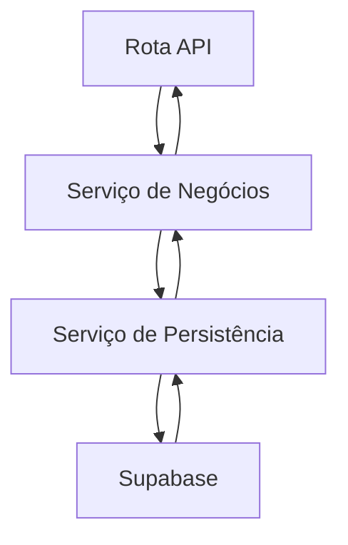
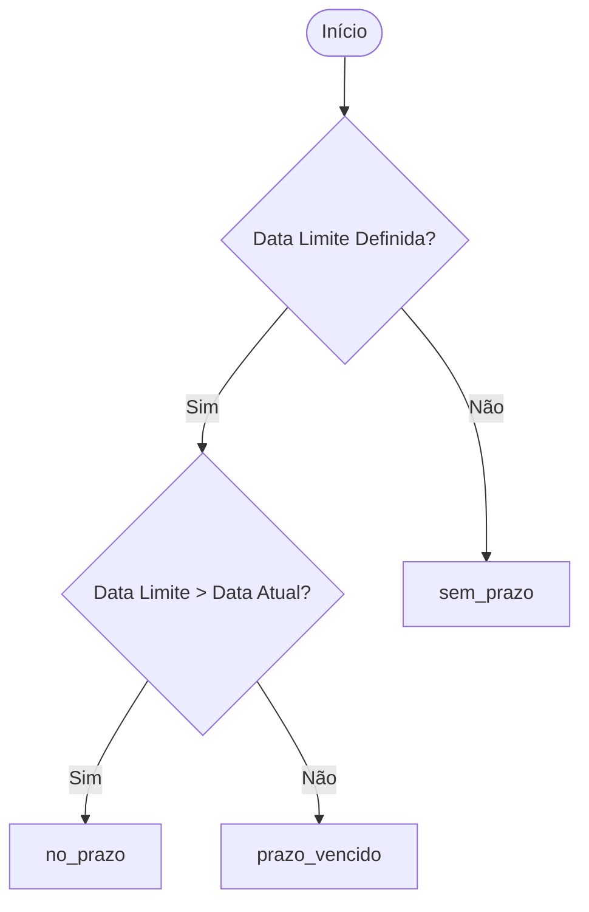
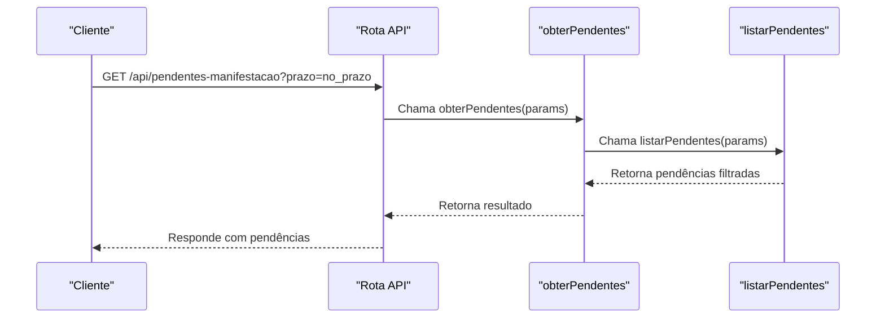

# Filtros por Prazo

<cite>
**Arquivos Referenciados neste Documento**   
- [listar-pendentes.service.ts](file://backend/pendentes/services/listar-pendentes.service.ts)
- [listar-pendentes.service.ts](file://backend/pendentes/services/persistence/listar-pendentes.service.ts)
- [types.ts](file://backend/types/pendentes/types.ts)
- [route.ts](file://app/api/pendentes-manifestacao/route.ts)
- [populate-pendentes-manifestacao.ts](file://dev_data/scripts/populate-pendentes-manifestacao.ts)
</cite>

## Sumário
1. [Introdução](#introdução)
2. [Arquitetura de Filtros por Prazo](#arquitetura-de-filtros-por-prazo)
3. [Diferença entre 'no_prazo' e 'sem_prazo'](#diferença-entre-no_prazo-e-sem_prazo)
4. [Implementação no Serviço listar-pendentes.service.ts](#implementação-no-serviço-listar-pendentes.servicets)
5. [Processamento do Parâmetro de Consulta 'prazo'](#processamento-do-parâmetro-de-consulta-prazo)
6. [Mapeamento para Condições SQL no Supabase](#mapeamento-para-condições-sql-no-supabase)
7. [Exemplos de Uso com Datas Atuais e Futuras](#exemplos-de-uso-com-datas-ativas-e-futuras)
8. [Cenários de Teste com populate-pendentes-manifestacao.ts](#cenários-de-teste-com-populate-pendentes-manifestacaots)
9. [Considerações de Fuso Horário e Formato ISO](#considerações-de-fuso-horário-e-formato-iso)
10. [Exemplos de Requisições e Respostas Esperadas](#exemplos-de-requisições-e-respostas-esperadas)
11. [Importância para Gestão Operacional de Prazos Jurídicos](#importância-para-gestão-operacional-de-prazos-jurídicos)

## Introdução
Este documento detalha o funcionamento dos filtros de prazo aplicados às pendências de manifestação no sistema Sinesys. O foco está na diferenciação entre os filtros 'no_prazo' e 'sem_prazo', sua implementação técnica no serviço `listar-pendentes.service.ts`, e como o parâmetro de consulta 'prazo' é processado na rota API e mapeado para condições SQL no Supabase. O documento também aborda cenários de teste, considerações de fuso horário, formatos de data ISO e exemplos práticos de uso, destacando a importância desses filtros para a gestão eficiente de prazos jurídicos.

## Arquitetura de Filtros por Prazo
A arquitetura de filtros por prazo é implementada em camadas, começando pela rota API, passando pelo serviço de negócios e chegando ao serviço de persistência. A rota `/api/pendentes-manifestacao` recebe os parâmetros de consulta, que são então processados pelo serviço `obterPendentes` no arquivo `listar-pendentes.service.ts`. Este serviço delega a consulta ao serviço de persistência `listarPendentes` no arquivo `persistence/listar-pendentes.service.ts`, que constrói a consulta SQL para o Supabase.

**Fontes do Diagrama**
- [route.ts](file://app/api/pendentes-manifestacao/route.ts#L1-L471)
- [listar-pendentes.service.ts](file://backend/pendentes/services/listar-pendentes.service.ts#L1-L36)
- [listar-pendentes.service.ts](file://backend/pendentes/services/persistence/listar-pendentes.service.ts#L1-L406)

**Fontes da Seção**
- [route.ts](file://app/api/pendentes-manifestacao/route.ts#L1-L471)
- [listar-pendentes.service.ts](file://backend/pendentes/services/listar-pendentes.service.ts#L1-L36)
- [listar-pendentes.service.ts](file://backend/pendentes/services/persistence/listar-pendentes.service.ts#L1-L406)

## Diferença entre 'no_prazo' e 'sem_prazo'
O filtro 'no_prazo' é aplicado quando a data limite de manifestação é posterior à data atual, indicando que o prazo ainda está ativo. O filtro 'sem_prazo' é aplicado quando não há data limite definida para a manifestação, ou seja, o processo não possui um prazo legal específico. Essa diferenciação é crucial para a gestão de pendências, pois permite identificar processos que estão próximos ao vencimento ou já vencidos, além de processos que não possuem prazo definido.

**Fontes do Diagrama**
- [listar-pendentes.service.ts](file://backend/pendentes/services/persistence/listar-pendentes.service.ts#L362-L363)
- [types.ts](file://backend/types/pendentes/types.ts#L37-L38)

**Fontes da Seção**
- [listar-pendentes.service.ts](file://backend/pendentes/services/persistence/listar-pendentes.service.ts#L362-L363)
- [types.ts](file://backend/types/pendentes/types.ts#L37-L38)

## Implementação no Serviço listar-pendentes.service.ts
O serviço `listar-pendentes.service.ts` implementa a lógica de negócios para listar pendências com filtros, paginação, ordenação e agrupamento. A função `obterPendentes` valida os parâmetros de entrada, aplica os filtros, a paginação e a ordenação, retornando uma lista paginada de pendências. Quando o parâmetro `agrupar_por` está presente, a função delega para `listarPendentesAgrupadoDb`, que retorna dados agrupados por um campo específico.

**Fontes do Diagrama**
- [listar-pendentes.service.ts](file://backend/pendentes/services/listar-pendentes.service.ts#L24-L33)
- [listar-pendentes.service.ts](file://backend/pendentes/services/persistence/listar-pendentes.service.ts#L53-L204)

**Fontes da Seção**
- [listar-pendentes.service.ts](file://backend/pendentes/services/listar-pendentes.service.ts#L24-L33)
- [listar-pendentes.service.ts](file://backend/pendentes/services/persistence/listar-pendentes.service.ts#L53-L204)

## Processamento do Parâmetro de Consulta 'prazo'
O parâmetro de consulta 'prazo' é processado na rota API `/api/pendentes-manifestacao` e mapeado para o parâmetro `prazo_vencido` no serviço de persistência. Quando o valor do parâmetro 'prazo' é 'no_prazo', o filtro `prazo_vencido` é definido como `false`. Quando o valor é 'sem_prazo', o filtro `data_prazo_legal_parte` é verificado como `null`. Esse mapeamento permite que a aplicação identifique pendências com base no status do prazo.

**Fontes da Seção**
- [route.ts](file://app/api/pendentes-manifestacao/route.ts#L398-L399)
- [listar-pendentes.service.ts](file://backend/pendentes/services/persistence/listar-pendentes.service.ts#L134-L136)

## Mapeamento para Condições SQL no Supabase
O serviço de persistência `listar-pendentes.service.ts` mapeia os parâmetros de consulta para condições SQL no Supabase. O filtro `prazo_vencido` é mapeado para a condição `eq('prazo_vencido', params.prazo_vencido)`, enquanto o filtro `data_prazo_legal_inicio` e `data_prazo_legal_fim` são mapeados para as condições `gte('data_prazo_legal_parte', params.data_prazo_legal_inicio)` e `lte('data_prazo_legal_parte', params.data_prazo_legal_fim)`, respectivamente. Essas condições garantem que apenas as pendências relevantes sejam retornadas.

**Fontes da Seção**
- [listar-pendentes.service.ts](file://backend/pendentes/services/persistence/listar-pendentes.service.ts#L134-L144)

## Exemplos de Uso com Datas Atuais e Futuras
Considere um cenário onde a data atual é 2025-04-05. Uma pendência com data limite de 2025-04-10 será classificada como 'no_prazo', pois a data limite é posterior à data atual. Uma pendência com data limite de 2025-04-01 será classificada como 'prazo_vencido', pois a data limite é anterior à data atual. Uma pendência sem data limite será classificada como 'sem_prazo'. Esses exemplos demonstram como o sistema identifica pendências próximas ao vencimento ou já vencidas.

**Fontes da Seção**
- [listar-pendentes.service.ts](file://backend/pendentes/services/persistence/listar-pendentes.service.ts#L134-L144)

## Cenários de Teste com populate-pendentes-manifestacao.ts
O script `populate-pendentes-manifestacao.ts` é utilizado para popular o banco de dados com resultados de pendências de manifestação. Ele processa arquivos JSON de pendências e insere os dados no banco, simulando diferentes cenários de teste com datas de limite variadas. Esse script é essencial para validar o comportamento dos filtros de prazo em diferentes situações, garantindo que a aplicação funcione corretamente em produção.

**Fontes da Seção**
- [populate-pendentes-manifestacao.ts](file://dev_data/scripts/populate-pendentes-manifestacao.ts#L1-L393)

## Considerações de Fuso Horário e Formato ISO
A aplicação trata datas em formato ISO 8601, garantindo consistência e interoperabilidade. As datas são armazenadas no banco de dados em formato `timestamptz`, que inclui informações de fuso horário. Isso é crucial para evitar problemas relacionados a fusos horários diferentes, especialmente em um ambiente jurídico onde prazos são rigorosamente controlados. A conversão de datas para o formato ISO é feita utilizando a função `toISOString()` do JavaScript.

**Fontes da Seção**
- [types.ts](file://backend/types/pendentes/types.ts#L66-L72)
- [populate-pendentes-manifestacao.ts](file://dev_data/scripts/populate-pendentes-manifestacao.ts#L92-L98)

## Exemplos de Requisições e Respostas Esperadas
Uma requisição com o parâmetro `prazo=no_prazo` retorna pendências com data limite posterior à data atual. Uma requisição com o parâmetro `prazo=sem_prazo` retorna pendências sem data limite definida. As respostas incluem metadados de paginação e ordenação, permitindo que o cliente navegue pelos resultados de forma eficiente. Esses exemplos ilustram como os filtros são aplicados e como os dados são retornados.

**Fontes da Seção**
- [route.ts](file://app/api/pendentes-manifestacao/route.ts#L437-L460)

## Importância para Gestão Operacional de Prazos Jurídicos
Os filtros de prazo são fundamentais para a gestão operacional de prazos jurídicos, pois permitem que os advogados identifiquem rapidamente pendências críticas que exigem atenção imediata. A capacidade de filtrar pendências por status de prazo ('no_prazo', 'prazo_vencido', 'sem_prazo') melhora a eficiência do escritório, reduzindo o risco de perda de prazos e garantindo um atendimento jurídico de qualidade. Esses filtros são uma ferramenta essencial para a organização e priorização de tarefas.

**Fontes da Seção**
- [listar-pendentes.service.ts](file://backend/pendentes/services/persistence/listar-pendentes.service.ts#L134-L144)
- [route.ts](file://app/api/pendentes-manifestacao/route.ts#L398-L399)