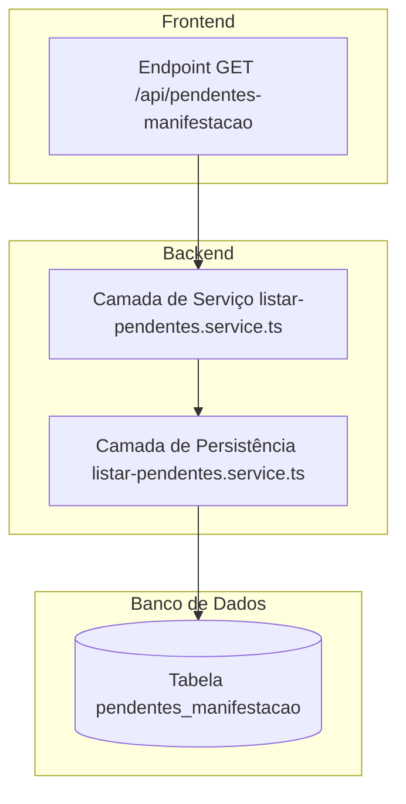
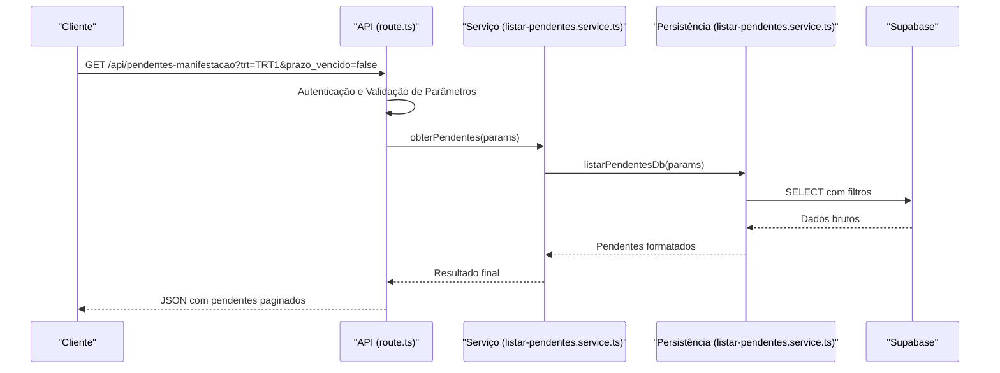
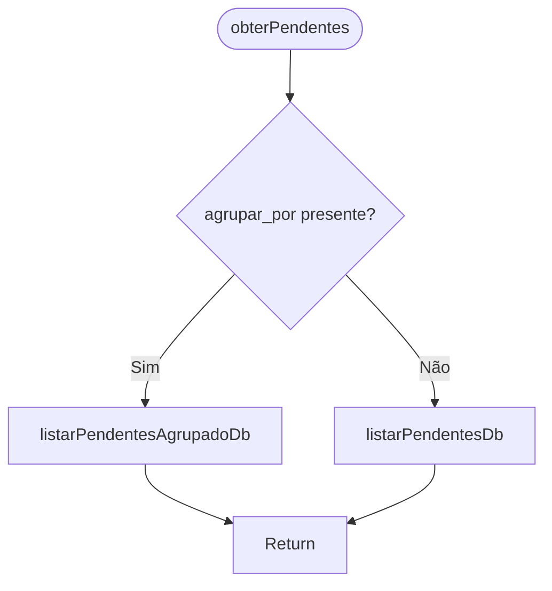
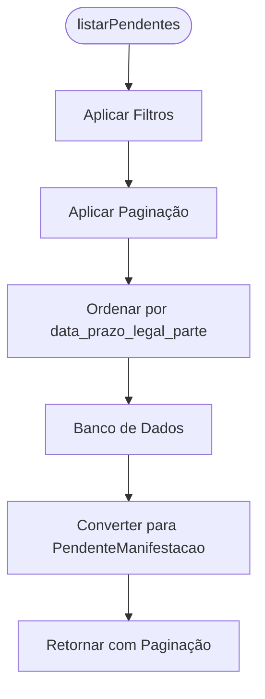
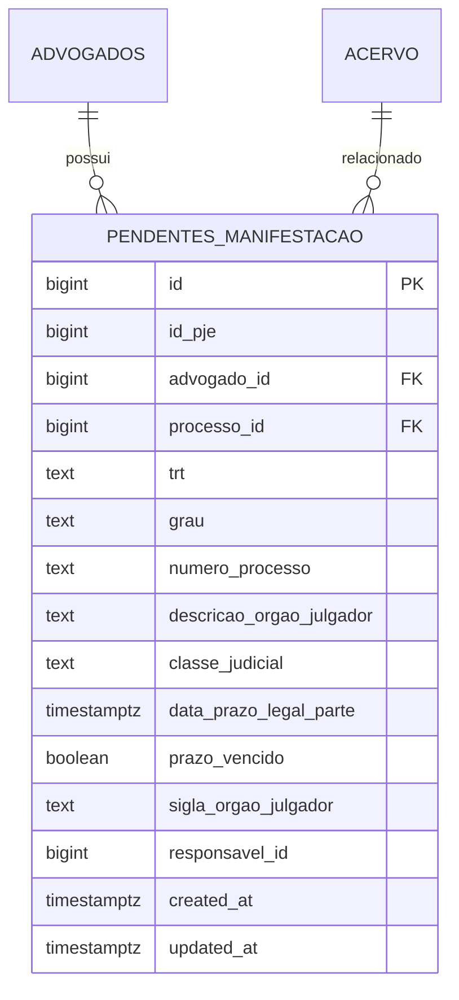
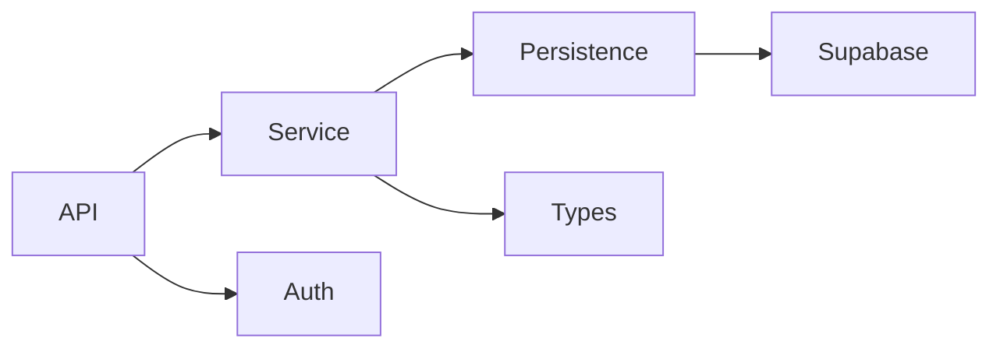

# Listagem de Pendentes

<cite>
**Arquivos Referenciados neste Documento**   
- [route.ts](file://app/api/pendentes-manifestacao/route.ts)
- [listar-pendentes.service.ts](file://backend/pendentes/services/listar-pendentes.service.ts)
- [listar-pendentes.service.ts](file://backend/pendentes/services/persistence/listar-pendentes.service.ts)
- [06_pendentes_manifestacao.sql](file://supabase/schemas/06_pendentes_manifestacao.sql)
- [resultado-2025-11-16T23-34-03-806Z.json](file://dev_data/scripts/results/api-pendentes-manifestacao/no_prazo/trt1/resultado-2025-11-16T23-34-03-806Z.json)
- [resultado-2025-11-16T23-13-03-211Z.json](file://dev_data/scripts/results/api-pendentes-manifestacao/sem_prazo/trt1/resultado-2025-11-16T23-13-03-211Z.json)
</cite>

## Sumário
1. [Introdução](#introdução)
2. [Estrutura do Projeto](#estrutura-do-projeto)
3. [Componentes Principais](#componentes-principais)
4. [Visão Geral da Arquitetura](#visão-geral-da-arquitetura)
5. [Análise Detalhada dos Componentes](#análise-detalhada-dos-componentes)
6. [Análise de Dependências](#análise-de-dependências)
7. [Considerações de Desempenho](#considerações-de-desempenho)
8. [Guia de Solução de Problemas](#guia-de-solução-de-problemas)
9. [Conclusão](#conclusão)

## Introdução
Este documento fornece uma análise detalhada do serviço de listagem de pendentes de manifestação no sistema Sinesys. O serviço permite a consulta de processos judiciais que aguardam manifestação por parte do advogado, com suporte a filtros avançados, paginação, ordenação e agrupamento. O endpoint principal é acessado via GET em `/api/pendentes-manifestacao`, aceitando diversos parâmetros de consulta para filtragem e controle de exibição dos dados.

## Estrutura do Projeto
A funcionalidade de listagem de pendentes de manifestação está organizada em diferentes camadas do projeto, seguindo uma arquitetura modular e bem definida. Os principais diretórios envolvidos são:

- `app/api/pendentes-manifestacao/`: Contém o endpoint da API que recebe as requisições HTTP.
- `backend/pendentes/services/`: Armazena a lógica de negócio e a camada de persistência.
- `supabase/schemas/`: Define o modelo de dados no banco de dados.
- `dev_data/scripts/results/api-pendentes-manifestacao/`: Contém dados de teste e resultados de execução para validação.

Essa estrutura permite clara separação de responsabilidades entre camadas de apresentação, negócio e dados.



**Fontes do Diagrama**
- [route.ts](file://app/api/pendentes-manifestacao/route.ts#L1-L471)
- [listar-pendentes.service.ts](file://backend/pendentes/services/listar-pendentes.service.ts#L1-L36)
- [listar-pendentes.service.ts](file://backend/pendentes/services/persistence/listar-pendentes.service.ts#L1-L406)
- [06_pendentes_manifestacao.sql](file://supabase/schemas/06_pendentes_manifestacao.sql#L1-L117)

**Fontes da Seção**
- [route.ts](file://app/api/pendentes-manifestacao/route.ts#L1-L471)
- [listar-pendentes.service.ts](file://backend/pendentes/services/listar-pendentes.service.ts#L1-L36)
- [listar-pendentes.service.ts](file://backend/pendentes/services/persistence/listar-pendentes.service.ts#L1-L406)
- [06_pendentes_manifestacao.sql](file://supabase/schemas/06_pendentes_manifestacao.sql#L1-L117)

## Componentes Principais

O serviço de listagem de pendentes de manifestação é composto por três componentes principais:

1. **Endpoint da API (`route.ts`)**: Recebe requisições HTTP, valida parâmetros de consulta e coordena a resposta.
2. **Camada de Serviço (`listar-pendentes.service.ts`)**: Coordena a lógica de negócio, decidindo entre listagem padrão ou agrupada.
3. **Camada de Persistência (`listar-pendentes.service.ts`)**: Executa consultas no banco de dados Supabase com filtros, paginação e ordenação.

Esses componentes trabalham em conjunto para fornecer uma interface robusta e eficiente para consulta de pendentes.

**Fontes da Seção**
- [route.ts](file://app/api/pendentes-manifestacao/route.ts#L1-L471)
- [listar-pendentes.service.ts](file://backend/pendentes/services/listar-pendentes.service.ts#L1-L36)
- [listar-pendentes.service.ts](file://backend/pendentes/services/persistence/listar-pendentes.service.ts#L1-L406)

## Visão Geral da Arquitetura

A arquitetura do serviço segue um padrão de camadas bem definido, onde cada componente tem responsabilidades específicas. O fluxo de dados inicia na API, passa pela camada de serviço e termina na camada de persistência, que interage diretamente com o banco de dados.



**Fontes do Diagrama**
- [route.ts](file://app/api/pendentes-manifestacao/route.ts#L341-L469)
- [listar-pendentes.service.ts](file://backend/pendentes/services/listar-pendentes.service.ts#L24-L34)
- [listar-pendentes.service.ts](file://backend/pendentes/services/persistence/listar-pendentes.service.ts#L53-L203)

## Análise Detalhada dos Componentes

### Análise do Endpoint da API

O endpoint `GET /api/pendentes-manifestacao` é responsável por receber requisições, validar parâmetros de consulta e retornar uma resposta formatada. Ele suporta diversos filtros como tribunal, grau, responsável, prazo vencido, datas de prazo legal, ciência e criação de expediente.

#### Validação de Parâmetros
O endpoint valida parâmetros como `pagina` (deve ser ≥ 1) e `limite` (entre 1 e 100). Também converte tipos como booleanos e IDs de responsável, permitindo valores como 'null' para processos sem responsável.

```mermaid
flowchart TD
Start([Requisição Recebida]) --> Auth[Autenticação]
Auth --> Params[Obter Parâmetros da Query]
Params --> ValidatePage{Página ≥ 1?}
ValidatePage --> |Não| ErrorPage[Retornar 400]
ValidatePage --> |Sim| ValidateLimit{Limite entre 1-100?}
ValidateLimit --> |Não| ErrorLimit[Retornar 400]
ValidateLimit --> |Sim| CallService[Chamar obterPendentes()]
CallService --> FormatResponse[Formatar Resposta]
FormatResponse --> End([Retornar JSON])
ErrorPage --> End
ErrorLimit --> End
```

**Fontes do Diagrama**
- [route.ts](file://app/api/pendentes-manifestacao/route.ts#L341-L469)

**Fontes da Seção**
- [route.ts](file://app/api/pendentes-manifestacao/route.ts#L341-L469)

### Análise da Camada de Serviço

A camada de serviço, implementada em `listar-pendentes.service.ts`, coordena a lógica de negócio. Ela decide se deve retornar uma listagem padrão ou agrupada com base no parâmetro `agrupar_por`.

#### Decisão de Listagem
Se o parâmetro `agrupar_por` estiver presente, o serviço chama `listarPendentesAgrupadoDb`. Caso contrário, utiliza `listarPendentesDb` para retornar uma lista paginada.



**Fontes do Diagrama**
- [listar-pendentes.service.ts](file://backend/pendentes/services/listar-pendentes.service.ts#L24-L34)

**Fontes da Seção**
- [listar-pendentes.service.ts](file://backend/pendentes/services/listar-pendentes.service.ts#L24-L34)

### Análise da Camada de Persistência

A camada de persistência implementa as consultas reais ao banco de dados. Ela suporta filtros complexos, paginação, ordenação e agrupamento em memória.

#### Consulta com Filtros
A função `listarPendentes` aplica filtros como TRT, grau, responsável, busca textual e filtros de data. A ordenação padrão é por `data_prazo_legal_parte` em ordem ascendente.

#### Agrupamento em Memória
A função `listarPendentesAgrupado` realiza a consulta sem paginação e agrupa os resultados em memória por campos como TRT, grau, responsável ou status do prazo.



**Fontes do Diagrama**
- [listar-pendentes.service.ts](file://backend/pendentes/services/persistence/listar-pendentes.service.ts#L53-L203)

**Fontes da Seção**
- [listar-pendentes.service.ts](file://backend/pendentes/services/persistence/listar-pendentes.service.ts#L53-L203)

### Modelo de Dados

O modelo de dados é definido no arquivo `06_pendentes_manifestacao.sql`, que cria a tabela `pendentes_manifestacao` com campos essenciais como `processo_id`, `data_prazo_legal`, `tipo_manifestacao`, `status` e `tribunal_origem`.

#### Campos Principais
- `processo_id`: Referência ao processo no acervo.
- `data_prazo_legal_parte`: Data limite para manifestação.
- `prazo_vencido`: Indica se o prazo já venceu.
- `trt`: Tribunal de origem (ex: TRT1).
- `grau`: Primeiro ou segundo grau.
- `responsavel_id`: ID do advogado responsável.

#### Índices
Vários índices são criados para otimizar consultas frequentes, como por `trt`, `grau`, `prazo_vencido` e `data_prazo_legal_parte`.



**Fontes do Diagrama**
- [06_pendentes_manifestacao.sql](file://supabase/schemas/06_pendentes_manifestacao.sql#L4-L117)

**Fontes da Seção**
- [06_pendentes_manifestacao.sql](file://supabase/schemas/06_pendentes_manifestacao.sql#L4-L117)

## Análise de Dependências

O serviço depende de vários componentes externos e internos:

- **Supabase**: Banco de dados relacional usado para armazenamento.
- **Autenticação**: Módulo `api-auth` para validar requisições.
- **Tipos**: Definições de tipos em `types/pendentes/types.ts`.



**Fontes do Diagrama**
- [route.ts](file://app/api/pendentes-manifestacao/route.ts#L5-L7)
- [listar-pendentes.service.ts](file://backend/pendentes/services/listar-pendentes.service.ts#L4-L7)

**Fontes da Seção**
- [route.ts](file://app/api/pendentes-manifestacao/route.ts#L5-L7)
- [listar-pendentes.service.ts](file://backend/pendentes/services/listar-pendentes.service.ts#L4-L7)

## Considerações de Desempenho

### Índices no Banco de Dados
A tabela `pendentes_manifestacao` possui múltiplos índices B-Tree para acelerar consultas comuns:

- `idx_pendentes_trt`: Por tribunal.
- `idx_pendentes_grau`: Por grau do processo.
- `idx_pendentes_prazo_vencido`: Por status do prazo.
- `idx_pendentes_data_prazo_legal`: Por data de prazo legal.

Esses índices garantem que filtros frequentes sejam executados de forma eficiente.

### Estratégias de Cache
Embora não implementado diretamente no código analisado, o uso de cache pode ser aplicado em camadas superiores para evitar consultas repetidas ao banco de dados, especialmente para filtros estáticos ou agrupamentos frequentes.

**Fontes da Seção**
- [06_pendentes_manifestacao.sql](file://supabase/schemas/06_pendentes_manifestacao.sql#L64-L75)

## Guia de Solução de Problemas

### Exemplos de Requisição

#### Filtro por 'no_prazo'
```http
GET /api/pendentes-manifestacao?trt=TRT1&prazo_vencido=false&pagina=1&limite=50
```

#### Filtro por 'sem_prazo'
```http
GET /api/pendentes-manifestacao?trt=TRT1&prazo_vencido=true&pagina=1&limite=50
```

### Exemplos de Resposta

#### Resposta com Pendentes no Prazo
```json
{
  "success": true,
  "data": {
    "pendentes": [
      {
        "id": 3226251,
        "numero_processo": "0100777-02.2024.5.01.0033",
        "nome_parte_autora": "RAUL DE ASSIS PACHECO",
        "data_prazo_legal_parte": "2025-11-26T23:59:59.999999",
        "prazo_vencido": false,
        "trt": "TRT1"
      }
    ],
    "paginacao": {
      "pagina": 1,
      "limite": 50,
      "total": 5,
      "totalPaginas": 1
    }
  }
}
```

#### Resposta com Pendentes sem Prazo
```json
{
  "success": true,
  "data": {
    "pendentes": [
      {
        "id": 3221777,
        "numero_processo": "0100725-33.2024.5.01.0024",
        "nome_parte_autora": "VIVIANE DA SILVA MOREIRA",
        "data_prazo_legal_parte": null,
        "prazo_vencido": false,
        "trt": "TRT1"
      }
    ],
    "paginacao": {
      "pagina": 1,
      "limite": 50,
      "total": 1,
      "totalPaginas": 1
    }
  }
}
```

### Tratamento de Erros
O serviço trata erros de validação retornando status 400 com mensagens descritivas, como:
- `"Parâmetro 'pagina' deve ser maior ou igual a 1"`
- `"Parâmetro 'limite' deve estar entre 1 e 100"`

Erros internos retornam status 500 com mensagem genérica para segurança.

**Fontes da Seção**
- [route.ts](file://app/api/pendentes-manifestacao/route.ts#L422-L434)
- [resultado-2025-11-16T23-34-03-806Z.json](file://dev_data/scripts/results/api-pendentes-manifestacao/no_prazo/trt1/resultado-2025-11-16T23-34-03-806Z.json)
- [resultado-2025-11-16T23-13-03-211Z.json](file://dev_data/scripts/results/api-pendentes-manifestacao/sem_prazo/trt1/resultado-2025-11-16T23-13-03-211Z.json)

## Conclusão
O serviço de listagem de pendentes de manifestação é uma componente central do sistema Sinesys, oferecendo uma interface poderosa e flexível para consulta de processos judiciais. Com suporte a múltiplos filtros, paginação, ordenação e agrupamento, o serviço atende às necessidades de advogados que precisam gerenciar seus prazos de manifestação. A arquitetura em camadas garante manutenibilidade e escalabilidade, enquanto os índices no banco de dados asseguram bom desempenho mesmo com grandes volumes de dados.