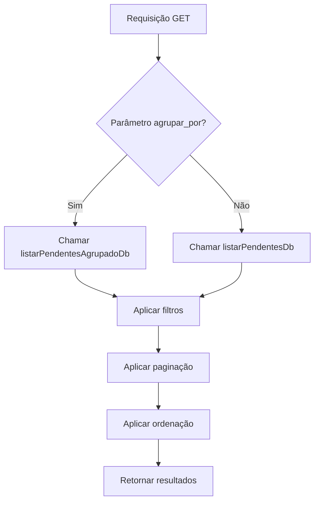
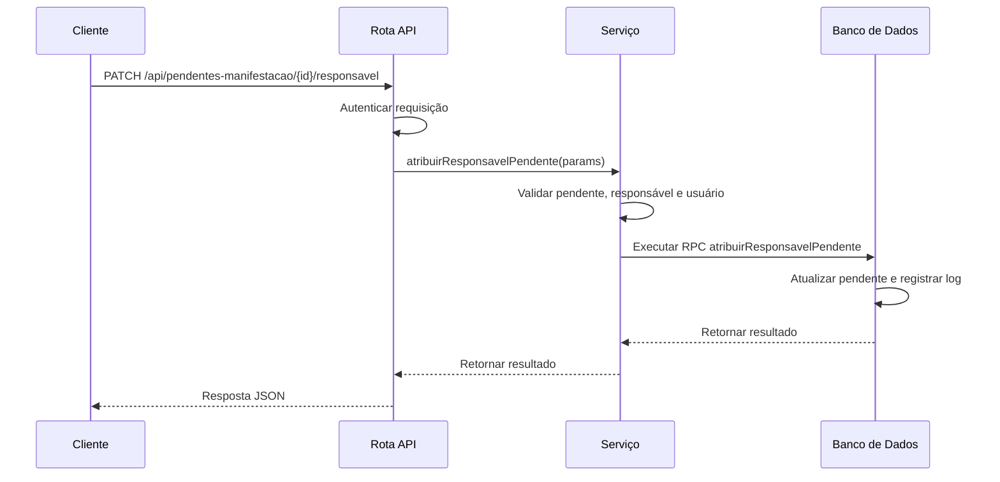
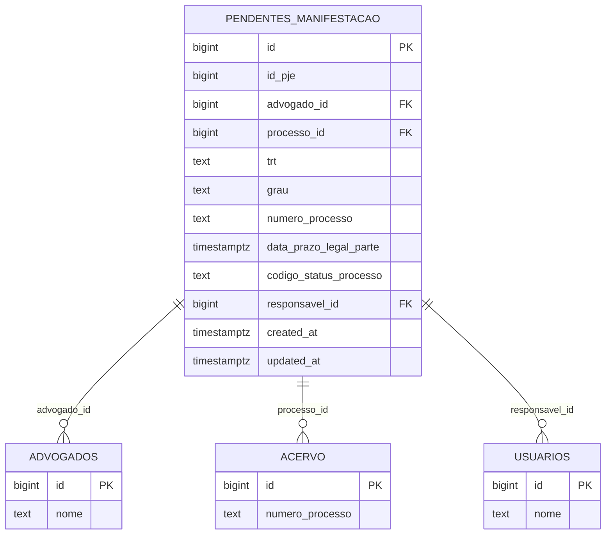

# Pendentes de Manifestação

<cite>
**Arquivos Referenciados neste Documento**   
- [listar-pendentes.service.ts](file://backend/pendentes/services/listar-pendentes.service.ts)
- [atribuir-responsavel.service.ts](file://backend/pendentes/services/atribuir-responsavel.service.ts)
- [route.ts](file://app/api/pendentes-manifestacao/route.ts)
- [route.ts](file://app/api/pendentes-manifestacao/[id]/responsavel/route.ts)
- [06_pendentes_manifestacao.sql](file://supabase/schemas/06_pendentes_manifestacao.sql)
- [populate-pendentes-manifestacao.ts](file://dev_data/scripts/populate-pendentes-manifestacao.ts)
- [types.ts](file://backend/types/pendentes/types.ts)
</cite>

## Sumário
1. [Introdução](#introdução)
2. [Conceito de Pendências de Manifestação](#conceito-de-pendências-de-manifestação)
3. [Ciclo de Vida das Pendências](#ciclo-de-vida-das-pendências)
4. [Importância Operacional](#importância-operacional)
5. [Serviço de Listagem de Pendentes](#serviço-de-listagem-de-pendentes)
6. [Atribuição de Responsáveis](#atribuição-de-responsáveis)
7. [Modelo de Dados](#modelo-de-dados)
8. [Exemplos de Requisições e Respostas](#exemplos-de-requisições-e-respostas)
9. [Scripts de População de Dados](#scripts-de-população-de-dados)
10. [Casos de Uso](#casos-de-uso)

## Introdução
Este documento detalha o módulo de Pendentes de Manifestação, um componente crítico para o monitoramento de processos jurídicos que exigem intervenção oportuna. O sistema permite a listagem, filtragem, atribuição de responsáveis e acompanhamento de prazos legais, garantindo que nenhuma manifestação importante seja perdida. A documentação abrange desde o conceito jurídico até a implementação técnica, incluindo serviços, rotas API, modelo de dados e exemplos práticos.

## Conceito de Pendências de Manifestação
Pendências de manifestação referem-se a processos judiciais que exigem uma resposta ou ação jurídica dentro de um prazo legal estabelecido. Essas pendências surgem quando uma parte é notificada de um ato processual (como ciência de decisão ou intimação) e deve se manifestar perante o tribunal dentro de um período específico. A falha em cumprir esse prazo pode resultar em prejuízos processuais significativos, como a perda do direito de contestar ou a prescrição de direitos.

Essas pendências são capturadas automaticamente do sistema PJE (Processo Judicial Eletrônico) e armazenadas no banco de dados para acompanhamento contínuo. Cada pendência contém informações essenciais como o número do processo, partes envolvidas, órgão julgador, data de ciência e, crucialmente, a data limite para manifestação.

**Fontes da Seção**
- [06_pendentes_manifestacao.sql](file://supabase/schemas/06_pendentes_manifestacao.sql#L1-L117)
- [types.ts](file://backend/types/pendentes/types.ts#L1-L58)

## Ciclo de Vida das Pendências
O ciclo de vida de uma pendência de manifestação inicia-se com sua captura no sistema PJE e termina com sua resolução ou arquivamento. O fluxo típico é:

1. **Captura**: O sistema realiza consultas periódicas ao PJE para identificar novos expedientes pendentes de manifestação.
2. **Armazenamento**: Os dados são inseridos na tabela `pendentes_manifestacao`, garantindo unicidade por ID do expediente, TRT, grau e número do processo.
3. **Notificação**: Pendências são exibidas na interface para os advogados responsáveis.
4. **Atribuição**: Um responsável é designado para gerenciar a pendência.
5. **Monitoramento**: O sistema acompanha o prazo legal, destacando pendências próximas do vencimento.
6. **Resolução**: Após a manifestação, a pendência pode ser arquivada ou atualizada.
7. **Histórico**: Todas as alterações são registradas para auditoria.

Este ciclo garante que todas as pendências sejam rastreadas desde sua origem até sua conclusão, proporcionando transparência e controle total sobre o fluxo de trabalho jurídico.

**Fontes da Seção**
- [06_pendentes_manifestacao.sql](file://supabase/schemas/06_pendentes_manifestacao.sql#L1-L117)
- [populate-pendentes-manifestacao.ts](file://dev_data/scripts/populate-pendentes-manifestacao.ts#L1-L393)

## Importância Operacional
A gestão eficaz de pendências de manifestação é fundamental para a operação de escritórios de advocacia, pois:

- **Evita prejuízos processuais**: O cumprimento de prazos legais é essencial para manter os direitos das partes.
- **Melhora a produtividade**: Automatiza o monitoramento de centenas de processos, liberando tempo para atividades estratégicas.
- **Garante conformidade**: Mantém um histórico completo de todas as ações, essencial para auditorias e controle interno.
- **Facilita a delegação**: Permite a atribuição clara de responsabilidades entre membros da equipe.
- **Fornece visibilidade**: Oferece painéis de controle com métricas sobre volume de pendências, prazos críticos e desempenho da equipe.

Sem um sistema robusto, o risco de perder prazos críticos aumenta exponencialmente, especialmente em escritórios com grande volume de processos.

## Serviço de Listagem de Pendentes
O serviço `listar-pendentes.service.ts` é responsável por recuperar pendências com base em diversos filtros, proporcionando flexibilidade na consulta de dados. O serviço atua como camada intermediária entre a rota API e a camada de persistência, aplicando validações e lógica de negócio.

### Funcionalidade Principal
O serviço exporta a função `obterPendentes`, que recebe parâmetros de filtro e retorna uma lista de pendências. O fluxo de execução é:

1. Verifica se o parâmetro `agrupar_por` está presente.
2. Se presente, utiliza a função de agrupamento; caso contrário, usa a listagem padrão.
3. Aplica filtros, paginação, ordenação e retorna os resultados.

Os filtros disponíveis incluem:
- **Filtros básicos**: TRT, grau, responsável
- **Busca textual**: em múltiplos campos como número do processo, partes envolvidas, órgão julgador
- **Filtros específicos**: por classe judicial, status do processo, segredo de justiça
- **Filtros de data**: por intervalos de data de autuação, ciência, prazo legal, etc.
- **Filtros de pendência**: por prazo vencido ou no prazo

A paginação é controlada pelos parâmetros `pagina` (padrão: 1) e `limite` (padrão: 50, máximo: 100). A ordenação padrão é por `data_prazo_legal_parte` em ordem ascendente, priorizando as pendências mais urgentes.



**Fontes do Diagrama**
- [listar-pendentes.service.ts](file://backend/pendentes/services/listar-pendentes.service.ts#L1-L35)

**Fontes da Seção**
- [listar-pendentes.service.ts](file://backend/pendentes/services/listar-pendentes.service.ts#L1-L35)
- [route.ts](file://app/api/pendentes-manifestacao/route.ts#L1-L471)

## Atribuição de Responsáveis
A funcionalidade de atribuição de responsáveis permite designar, transferir ou desatribuir um advogado responsável por uma pendência de manifestação. Esta operação é crítica para a gestão de tarefas e responsabilidades dentro do escritório.

### Implementação
O serviço `atribuir-responsavel.service.ts` implementa a lógica de negócio para esta operação, com as seguintes características:

- **Validações rigorosas**: Verifica a existência do pendente, do responsável e do usuário que executa a ação.
- **Tipos de operação**:
  - **Atribuição**: Quando um pendente sem responsável recebe um responsável.
  - **Transferência**: Quando o responsável de um pendente é alterado.
  - **Dessatribuição**: Quando o responsável é removido (responsavelId = null).
- **Registro de auditoria**: Todas as alterações são automaticamente registradas na tabela `logs_alteracao`.

A persistência é realizada através de uma função RPC (Remote Procedure Call) no banco de dados, que garante consistência e segurança. A função valida as permissões e executa a atualização com o contexto do usuário que realizou a ação.



**Fontes do Diagrama**
- [atribuir-responsavel.service.ts](file://backend/pendentes/services/atribuir-responsavel.service.ts#L1-L154)
- [route.ts](file://app/api/pendentes-manifestacao/[id]/responsavel/route.ts#L1-L191)

**Fontes da Seção**
- [atribuir-responsavel.service.ts](file://backend/pendentes/services/atribuir-responsavel.service.ts#L1-L154)
- [route.ts](file://app/api/pendentes-manifestacao/[id]/responsavel/route.ts#L1-L191)
- [20251117015305_add_responsavel_id_tables.sql](file://supabase/migrations/20251117015305_add_responsavel_id_tables.sql#L24-L31)

## Modelo de Dados
O modelo de dados para pendências de manifestação é definido na tabela `pendentes_manifestacao`, que armazena todas as informações relevantes sobre os processos pendentes.

### Estrutura da Tabela
A tabela possui os seguintes campos principais:

| Campo | Tipo | Descrição |
|-------|------|-----------|
| id | bigint | Chave primária gerada automaticamente |
| id_pje | bigint | ID do expediente no sistema PJE |
| advogado_id | bigint | Referência ao advogado que capturou o expediente |
| processo_id | bigint | Referência ao processo no acervo (preenchido automaticamente) |
| trt | public.codigo_tribunal | Código do TRT onde o processo está tramitando |
| grau | public.grau_tribunal | Grau do processo (primeiro_grau ou segundo_grau) |
| numero_processo | text | Número do processo no formato CNJ |
| data_prazo_legal_parte | timestamptz | Data limite para manifestação da parte |
| status | text | Status do processo (ex: DISTRIBUIDO) |
| responsavel_id | bigint | Usuário responsável pelo processo (adicionado por migração) |
| created_at | timestamptz | Data de criação do registro |
| updated_at | timestamptz | Data da última atualização |

### Restrições e Índices
- **Chave primária**: `id`
- **Restrição de unicidade**: `(id_pje, trt, grau, numero_processo)` garante que o mesmo expediente não seja duplicado.
- **Chaves estrangeiras**: `advogado_id` referencia `advogados(id)`, `processo_id` referencia `acervo(id)`, `responsavel_id` referencia `usuarios(id)`.
- **Índices**: Vários índices foram criados para otimizar consultas por advogado, TRT, grau, número do processo, prazo vencido e data do prazo legal.

### Triggers
- **update_pendentes_manifestacao_updated_at**: Atualiza automaticamente o campo `updated_at` em cada modificação.
- **sync_pendentes_processo_id_trigger**: Preenche automaticamente o campo `processo_id` baseado no `numero_processo`, `trt` e `grau`, buscando na tabela `acervo`.



**Fontes do Diagrama**
- [06_pendentes_manifestacao.sql](file://supabase/schemas/06_pendentes_manifestacao.sql#L1-L117)

**Fontes da Seção**
- [06_pendentes_manifestacao.sql](file://supabase/schemas/06_pendentes_manifestacao.sql#L1-L117)
- [20251117015305_add_responsavel_id_tables.sql](file://supabase/migrations/20251117015305_add_responsavel_id_tables.sql#L24-L31)

## Exemplos de Requisições e Respostas
Esta seção demonstra o uso prático das rotas API para consultar e atualizar pendências de manifestação.

### Listagem de Pendências
**Requisição para pendências no prazo:**
```
GET /api/pendentes-manifestacao?trt=TRT3&grau=primeiro_grau&prazo_vencido=false&pagina=1&limite=10
```

**Resposta:**
```json
{
  "success": true,
  "data": {
    "pendentes": [
      {
        "id": 123,
        "numero_processo": "0010014-94.2025.5.03.0022",
        "nome_parte_autora": "João Silva",
        "nome_parte_re": "Empresa XYZ",
        "data_prazo_legal_parte": "2025-01-20T10:00:00.000Z",
        "prazo_vencido": false,
        "responsavel_id": 15
      }
    ],
    "paginacao": {
      "pagina": 1,
      "limite": 10,
      "total": 25,
      "totalPaginas": 3
    }
  }
}
```

### Atribuição de Responsável
**Requisição para atribuir responsável:**
```
PATCH /api/pendentes-manifestacao/123/responsavel
Content-Type: application/json

{
  "responsavelId": 15
}
```

**Resposta de sucesso:**
```json
{
  "success": true,
  "data": {
    "id": 123,
    "responsavel_id": 15,
    "updated_at": "2025-01-15T10:30:00.000Z"
  }
}
```

**Resposta de erro (pendente não encontrado):**
```json
{
  "error": "Processo pendente não encontrado",
  "status": 404
}
```

**Fontes da Seção**
- [route.ts](file://app/api/pendentes-manifestacao/route.ts#L1-L471)
- [route.ts](file://app/api/pendentes-manifestacao/[id]/responsavel/route.ts#L1-L191)

## Scripts de População de Dados
O script `populate-pendentes-manifestacao.ts` é utilizado para alimentar o banco de dados com dados de teste, facilitando o desenvolvimento e testes da aplicação.

### Funcionalidade
O script realiza as seguintes operações:
1. Lê arquivos JSON de dois diretórios: `pendentes-manifestacao` e `api-pendentes-manifestacao`.
2. Processa cada arquivo, extraindo os dados dos processos pendentes.
3. Insere os registros na tabela `pendentes_manifestacao`, evitando duplicatas através da constraint de unicidade.
4. Gera um relatório detalhado com estatísticas de inserção, descarte de duplicatas e erros.

O script é essencial para:
- **Testes de integração**: Garante que o sistema funcione com dados realistas.
- **Desenvolvimento**: Permite que desenvolvedores trabalhem com um conjunto de dados completo.
- **Demonstrações**: Facilita a apresentação do sistema com dados representativos.

O processo de inserção valida cada registro e descarta duplicatas silenciosamente, registrando estatísticas para auditoria. Em caso de erro na inserção (não relacionado a duplicata), o erro é registrado e o processamento continua.

**Fontes da Seção**
- [populate-pendentes-manifestacao.ts](file://dev_data/scripts/populate-pendentes-manifestacao.ts#L1-L393)

## Casos de Uso
### Monitoramento de Prazos
O sistema permite configurar alertas para pendências próximas do vencimento. Por exemplo, um advogado pode configurar uma consulta diária para pendências com prazo em até 3 dias:

```
GET /api/pendentes-manifestacao?prazo_vencido=false&data_prazo_legal_inicio=2025-01-15&data_prazo_legal_fim=2025-01-18
```

Isso permite uma gestão proativa de prazos, evitando surpresas de última hora.

### Notificações de Vencimento
Quando uma pendência atinge seu prazo limite, o campo `prazo_vencido` é atualizado para `true`. Isso pode disparar notificações automáticas para o responsável e supervisores, garantindo que ações corretivas sejam tomadas imediatamente.

A combinação de filtros permite criar painéis de controle específicos:
- Pendências vencidas por responsável
- Volume de pendências por TRT e grau
- Tendências de prazos por mês

Esses casos de uso demonstram como o módulo de Pendentes de Manifestação transforma dados processuais em insights operacionais, melhorando significativamente a eficiência e segurança jurídica do escritório.

**Fontes da Seção**
- [06_pendentes_manifestacao.sql](file://supabase/schemas/06_pendentes_manifestacao.sql#L1-L117)
- [route.ts](file://app/api/pendentes-manifestacao/route.ts#L1-L471)
- [types.ts](file://backend/types/pendentes/types.ts#L1-L58)