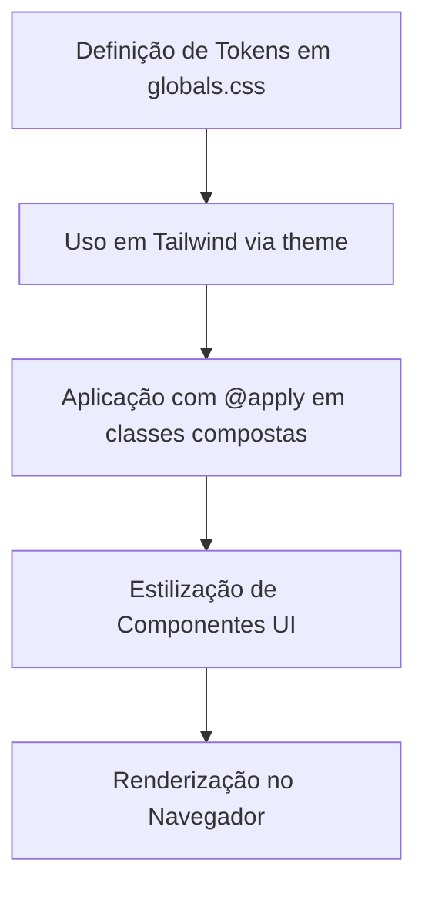
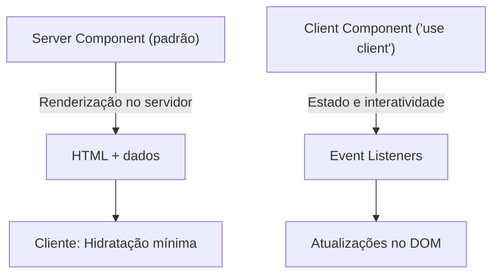

# Stack Tecnológica e Dependências

<cite>
**Arquivos Referenciados neste Documento**  
- [package.json](file://package.json) - *Atualizado para Next.js 16*
- [next.config.ts](file://next.config.ts) - *Configuração de build standalone e imagens remotas*
- [tsconfig.json](file://tsconfig.json) - *Configuração TypeScript com strict mode*
- [app/globals.css](file://app/globals.css) - *Tokens CSS e design system*
- [components/ui/button.tsx](file://components/ui/button.tsx) - *Componente de botão com variantes*
- [components/ui/card.tsx](file://components/ui/card.tsx) - *Componente de card acessível*
- [components/header.tsx](file://components/header.tsx) - *Componente interativo com 'use client'*
- [app/layout.tsx](file://app/layout.tsx)
- [app/page.tsx](file://app/page.tsx)
- [components/ui/footer.tsx](file://components/ui/footer.tsx)
- [components/hero.tsx](file://components/hero.tsx)
</cite>

## Atualização de Versão
**Alterações Realizadas**  
- Atualização da versão do Next.js de 15.3.4 para 16.0.0
- Atualização correspondente do React para versão 19
- Atualização do TypeScript para versão 5
- Atualização do TailwindCSS para versão 4.1.11
- Atualização dos scripts de desenvolvimento para uso contínuo do Turbopack
- Atualização da configuração do ESLint para compatibilidade com Next.js 16

## Sumário
1. [Introdução](#introdução)
2. [Tecnologias Principais](#tecnologias-principais)
3. [Dependências do Projeto](#dependências-do-projeto)
4. [Configurações Críticas](#configurações-críticas)
5. [Integração de Tecnologias](#integração-de-tecnologias)
6. [Decisões Arquiteturais](#decisões-arquiteturais)
7. [Orientações para Novos Desenvolvedores](#orientações-para-novos-desenvolvedores)
8. [Conclusão](#conclusão)

## Introdução
Este documento detalha a stack tecnológica utilizada no projeto `website-pz`, um site institucional para um escritório de advocacia. A arquitetura é baseada em tecnologias modernas como Next.js 16, React 19, TypeScript 5 e TailwindCSS v4, com ênfase em acessibilidade, design consistente e desempenho. O projeto adota boas práticas de desenvolvimento, incluindo componentes reutilizáveis, tipagem rigorosa e estilização baseada em tokens. A atualização para Next.js 16 traz melhorias significativas no desempenho e novos recursos de otimização.

## Tecnologias Principais

### Next.js 16.0.0
Next.js é o framework principal do projeto, responsável pela renderização do lado do servidor (SSR), roteamento, otimização de imagens e geração de sites estáticos. A versão 16 introduz melhorias significativas no desempenho com o Turbopack, utilizado no script de desenvolvimento (`"dev": "next dev --turbopack"`). O uso de Server Components por padrão permite carregamento eficiente de conteúdo, enquanto componentes interativos são marcados com `'use client'`. Esta atualização também melhora a compatibilidade com ambientes serverless e a geração de builds standalone.

### React 19
O React 19 traz novos recursos de concorrência e otimizações internas que melhoram a fluidez da interface. O projeto utiliza React Server Components para renderizar conteúdo estático no servidor, reduzindo o tempo de interatividade (TTI) e melhorando o SEO. Componentes que exigem interatividade, como botões e formulários, são explicitamente definidos como Client Components. A integração com o Next.js 16 aproveita ao máximo os recursos de streaming e suspense.

### TypeScript 5
O TypeScript 5 é usado para garantir tipagem estática rigorosa em todo o código. A configuração `strict: true` no `tsconfig.json` ativa todas as verificações de tipo, prevenindo erros comuns em tempo de desenvolvimento. Isso é especialmente importante em um projeto com múltiplos desenvolvedores, pois garante consistência e segurança no código. A versão 5 também melhora a velocidade de compilação e suporte a decorators.

### TailwindCSS v4.1.11
TailwindCSS é o sistema de estilização principal, utilizado em conjunto com o plugin `@tailwindcss/typography` para estilização de conteúdo textual. O projeto aproveita a capacidade do Tailwind de usar classes utilitárias diretamente no JSX, promovendo desenvolvimento rápido e consistente. O uso de `@apply` em `globals.css` permite a criação de estilos compostos reutilizáveis. A versão 4.1.11 inclui melhorias na performance do build e suporte a novas funcionalidades de animação.

**Fontes da seção**
- [package.json](file://package.json#L1-L45) - *Atualização de versões principais*
- [tsconfig.json](file://tsconfig.json#L1-L27) - *Configuração TypeScript*

## Dependências do Projeto

### Radix UI
O Radix UI fornece componentes primitivos acessíveis e sem estilos, como `Accordion`, `Dialog`, `Tabs`, `Select` e `NavigationMenu`. Esses componentes são usados como base para construir o sistema de design personalizado, garantindo compatibilidade com leitores de tela e navegação por teclado. A acessibilidade é uma prioridade, especialmente em um site jurídico onde clareza e usabilidade são essenciais. As versões atuais são compatíveis com React 19 e Next.js 16.

### shadcn/ui
Embora não seja uma dependência direta no `package.json`, o projeto segue o padrão do shadcn/ui, utilizando componentes baseados em Radix UI e estilizados com Tailwind. Os componentes em `components/ui/` (como `button.tsx`, `card.tsx`) seguem essa abordagem, combinando acessibilidade com design moderno. Esta arquitetura permite personalização extensiva enquanto mantém consistência visual.

### Framer Motion
O Framer Motion é usado para animações fluidas e interações dinâmicas. Ele permite animações baseadas em gestos, transições suaves e efeitos visuais que melhoram a experiência do usuário sem comprometer o desempenho. É especialmente útil em componentes como acordeões, modais e efeitos de entrada. A versão 12.19.2 é compatível com React 19 e oferece melhorias na performance de animações.

### Lucide e MynaUI para Ícones
O projeto utiliza ícones do `@mynaui/icons-react` e `@tabler/icons-react`, que são variantes do Lucide. Esses ícones são leves, consistentes e acessíveis, com suporte a tamanho e cor via props. Eles são usados em botões, rodapés e interfaces interativas, garantindo uma linguagem visual coesa. A escolha do MynaUI alinha-se com o design system do projeto.

**Fontes da seção**
- [package.json](file://package.json#L1-L45) - *Dependências listadas*
- [components/ui/button.tsx](file://components/ui/button.tsx#L1-L59) - *Uso de ícones e estilização*
- [components/ui/card.tsx](file://components/ui/card.tsx#L1-L79) - *Componente acessível*
- [components/hero.tsx](file://components/hero.tsx#L1-L42) - *Integração de componentes*

## Configurações Críticas

### next.config.ts
O arquivo `next.config.ts` contém configurações essenciais para o funcionamento do site:
- `output: 'standalone'`: Gera uma build otimizada para implantação em ambientes serverless.
- `images.remotePatterns`: Permite o carregamento de imagens do Unsplash (`images.unsplash.com`), essencial para conteúdo visual dinâmico e de alta qualidade.

Essa configuração de imagens é crucial para otimizar o desempenho e garantir que imagens externas sejam carregadas com segurança e cache adequado. A configuração é compatível com as práticas de segurança do Next.js 16.

```typescript
import type { NextConfig } from "next";

const nextConfig: NextConfig = {
  output: 'standalone',
  images: {
    remotePatterns: [
      {
        protocol: 'https',
        hostname: 'images.unsplash.com',
        port: '',
        pathname: '/**',
      },
    ],
  },
};

export default nextConfig;
```

**Fontes da seção**
- [next.config.ts](file://next.config.ts#L1-L17) - *Configuração completa*

### tsconfig.json
O `tsconfig.json` define as regras de compilação do TypeScript:
- `strict: true`: Ativa todas as verificações rigorosas de tipo.
- `jsx: "react-jsx"`: Permite que o Next.js processe o JSX com suporte a React 19.
- `paths: {"@/*": ["./*"]}`: Habilita imports absolutos, melhorando a legibilidade e manutenção do código.
- `moduleResolution: "bundler"`: Compatível com modernos bundlers como Turbopack.

Essas configurações garantem um ambiente de desenvolvimento seguro, escalável e compatível com as últimas práticas do ecossistema React. A configuração também inclui suporte a decorators, necessário para futuras extensões.

```json
{
  "compilerOptions": {
    "target": "ES2017",
    "lib": [
      "dom",
      "dom.iterable",
      "esnext"
    ],
    "allowJs": true,
    "skipLibCheck": true,
    "strict": true,
    "noEmit": true,
    "esModuleInterop": true,
    "module": "esnext",
    "moduleResolution": "bundler",
    "resolveJsonModule": true,
    "isolatedModules": true,
    "jsx": "react-jsx",
    "incremental": true,
    "plugins": [
      {
        "name": "next"
      }
    ],
    "paths": {
      "@/*": [
        "./*"
      ]
    }
  },
  "include": [
    "next-env.d.ts",
    "**/*.ts",
    "**/*.tsx",
    ".next/types/**/*.ts"
  ],
  "exclude": [
    "node_modules"
  ]
}
```

**Fontes da seção**
- [tsconfig.json](file://tsconfig.json#L1-L43) - *Configuração completa*

## Integração de Tecnologias

### Tailwind com Design System em globals.css
O arquivo `globals.css` define um sistema de design baseado em tokens CSS, utilizando variáveis como `--primary`, `--background`, `--radius`, entre outros. Esses tokens são usados pelo Tailwind via `theme` e `@apply`, permitindo uma paleta de cores consistente, esquemas de luz e escuro, e estilos de sombra e blur personalizados.

A integração inclui:
- Suporte a modo escuro com a classe `.dark`.
- Animações personalizadas como `accordion-down`.
- Estilos base aplicados com `@layer base`.
- Uso de `@plugin '@tailwindcss/typography'` para formatação de texto rico.

Essa abordagem centraliza o design, facilitando atualizações e garantindo consistência visual em toda a aplicação.



**Fontes do diagrama**
- [app/globals.css](file://app/globals.css#L1-L250) - *Definição completa de tokens*

**Fontes da seção**
- [app/globals.css](file://app/globals.css#L1-L250) - *Design system completo*

## Decisões Arquiteturais

### Server Components por Padrão
O Next.js 16 utiliza Server Components como padrão. Isso significa que a maioria dos componentes é renderizada no servidor, reduzindo o tamanho do bundle do cliente e melhorando o desempenho. Componentes como `layout.tsx` e `page.tsx` são Server Components, carregando dados e renderizando HTML antes do envio ao navegador. Esta abordagem é essencial para SEO e performance.

### Uso de 'use client' para Interatividade
Componentes que exigem estado ou eventos do navegador (como cliques, hover, formulários) devem ser marcados com `'use client'`. Exemplos incluem `Header`, `Button` e `Footer`. Essa separação clara entre Server e Client Components otimiza o desempenho e evita problemas de hidratação. O componente `header.tsx` é um exemplo perfeito dessa prática.



**Fontes do diagrama**
- [app/layout.tsx](file://app/layout.tsx#L1-L39) - *Server Component*
- [components/header.tsx](file://components/header.tsx#L1-L17) - *Client Component*

**Fontes da seção**
- [app/page.tsx](file://app/page.tsx#L1-L21) - *Exemplo de Server Component*
- [components/header.tsx](file://components/header.tsx#L1-L17) - *Exemplo de Client Component*

## Orientações para Novos Desenvolvedores

### Estrutura de Pastas
- `app/`: Rotas e layouts baseados no App Router do Next.js.
- `components/`: Componentes reutilizáveis, divididos em `ui/` (primitivos) e específicos da aplicação.
- `lib/`: Utilitários e funções auxiliares.
- `public/`: Arquivos estáticos (imagens, favicons).

### Adicionando Novos Componentes
1. Para componentes genéricos, crie em `components/ui/` usando Radix UI como base.
2. Use `cva` (class-variance-authority) para variantes de estilo.
3. Sempre que possível, mantenha como Server Component; use `'use client'` apenas se necessário.

### Estilização
- Evite classes inline; prefira classes do Tailwind.
- Use tokens definidos em `globals.css` para cores, espaçamentos e sombras.
- Para estilos complexos, defina com `@apply` em `globals.css`.

### Tipagem
- Sempre que possível, defina interfaces para props.
- Use `VariantProps<typeof componente>` para extrair variantes do `cva`.
- Evite `any`; prefira `unknown` ou tipagem explícita.

**Fontes da seção**
- [components/ui/button.tsx](file://components/ui/button.tsx#L1-L59) - *Exemplo de componente tipado*
- [lib/utils.ts](file://lib/utils.ts) - *Utilitários*
- [components/ui/footer.tsx](file://components/ui/footer.tsx#L1-L138) - *Componente complexo*

## Conclusão
A stack tecnológica do projeto `website-pz` combina modernidade, desempenho e acessibilidade. O uso de Next.js 16 com React 19 permite uma arquitetura eficiente baseada em Server Components, enquanto TypeScript 5 e TailwindCSS v4 garantem código seguro e design consistente. As dependências como Radix UI, Framer Motion e ícones do Lucide/MynaUI complementam o ecossistema, oferecendo componentes acessíveis e visualmente atraentes. As configurações em `next.config.ts` e `tsconfig.json` refletem boas práticas de produção, e a integração com tokens CSS em `globals.css` centraliza o design. Esta stack é ideal para projetos institucionais que exigem alta qualidade técnica e experiência do usuário excepcional.