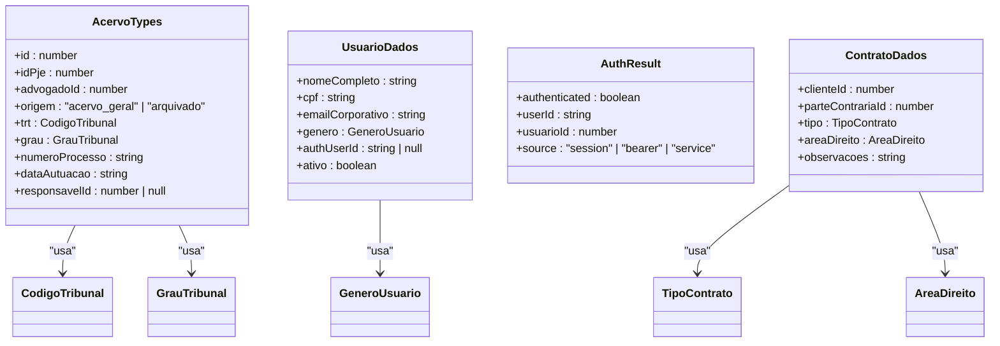
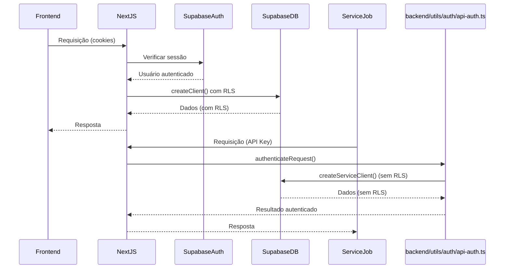
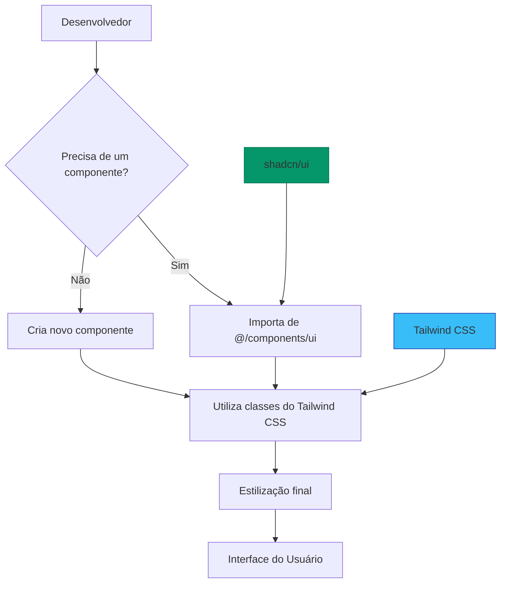

# Stack Tecnológica

<cite>
**Arquivos Referenciados neste Documento**   
- [next.config.ts](file://next.config.ts)
- [swagger.config.ts](file://swagger.config.ts)
- [app/docs/page.tsx](file://app/docs/page.tsx)
- [app/api/docs/openapi.json/route.ts](file://app/api/docs/openapi.json/route.ts)
- [backend/utils/supabase/server.ts](file://backend/utils/supabase/server.ts)
- [backend/utils/supabase/service-client.ts](file://backend/utils/supabase/service-client.ts)
- [backend/utils/auth/api-auth.ts](file://backend/utils/auth/api-auth.ts)
- [components.json](file://components.json)
- [postcss.config.mjs](file://postcss.config.mjs)
- [eslint.config.mjs](file://eslint.config.mjs)
- [package.json](file://package.json)
- [tsconfig.json](file://tsconfig.json)
- [supabase/migrations/](file://supabase/migrations/)
- [supabase/schemas/](file://supabase/schemas/)
</cite>

## Sumário
1. [Introdução](#introdução)
2. [Next.js com App Router](#nextjs-com-app-router)
3. [TypeScript e Tipagem Estática](#typescript-e-tipagem-estática)
4. [Integração com Supabase](#integração-com-supabase)
5. [Componentes UI e Estilização](#componentes-ui-e-estilização)
6. [Documentação de API com Swagger/OpenAPI](#documentação-de-api-com-swaggeropenapi)
7. [Ferramentas de Desenvolvimento](#ferramentas-de-desenvolvimento)
8. [Considerações de Versão e Compatibilidade](#considerações-de-versão-e-compatibilidade)

## Introdução

O projeto Sinesys é um sistema de gestão jurídica desenvolvido com uma stack tecnológica moderna e robusta, projetada para atender às necessidades específicas de escritórios de advocacia. A arquitetura combina as melhores práticas de desenvolvimento frontend e backend, utilizando tecnologias líderes no mercado para garantir desempenho, segurança e escalabilidade. Este documento detalha a stack tecnológica empregada, com foco nos principais componentes: Next.js como framework principal, TypeScript para tipagem estática, Supabase para backend e autenticação, shadcn/ui e Tailwind CSS para a interface do usuário, e Swagger para documentação de APIs.

**Fontes da seção**
- [openspec/project.md](file://openspec/project.md#L1-L111)

## Next.js com App Router

O framework principal do projeto é o **Next.js 16**, que utiliza o **App Router** como sistema de roteamento. Esta escolha arquitetural permite uma estrutura de aplicação mais moderna e eficiente, aproveitando ao máximo os recursos do React Server Components (RSC) e Server Actions.

O App Router, localizado no diretório `app/`, organiza as rotas do aplicativo de forma hierárquica e baseada em convenções. As rotas são definidas por meio da criação de diretórios e arquivos específicos, como `page.tsx` para páginas e `route.ts` para endpoints de API. O diretório `(dashboard)` indica rotas protegidas, que exigem autenticação do usuário.

Os **React Server Components** são um pilar fundamental da arquitetura. Eles permitem que a maior parte da renderização da interface do usuário ocorra no servidor, reduzindo significativamente o tamanho do pacote enviado ao cliente e melhorando o desempenho geral da aplicação. Isso é especialmente benéfico para um sistema jurídico complexo como o Sinesys, que lida com grandes volumes de dados.

Os **Server Actions** são utilizados para executar operações assíncronas diretamente no servidor, como chamadas ao banco de dados ou integrações com APIs externas. Essas ações são definidas em arquivos do App Router e podem ser chamadas diretamente a partir de componentes do cliente, simplificando o fluxo de dados e melhorando a segurança, pois a lógica sensível permanece no servidor.

A configuração do SSR (Server-Side Rendering) é definida no arquivo `next.config.ts`. Embora o arquivo esteja atualmente vazio, ele está preparado para receber opções de configuração específicas do Next.js, como otimizações de imagem, configurações de internacionalização ou personalizações de build.

```mermaid
graph TB
A[Cliente (Browser)] --> B[Next.js App Router]
B --> C{Tipo de Rota}
C --> |Página| D[React Server Component]
C --> |API| E[API Route]
D --> F[Server Action]
E --> G[Backend Service]
F --> G
G --> H[Supabase Database]
H --> G
G --> E
G --> F
F --> D
D --> A
E --> A
```

**Fontes do diagrama**
- [next.config.ts](file://next.config.ts#L1-L7)
- [app/page.tsx](file://app/page.tsx)
- [app/api/contratos/route.ts](file://app/api/contratos/route.ts)

**Fontes da seção**
- [next.config.ts](file://next.config.ts#L1-L7)
- [app/page.tsx](file://app/page.tsx)
- [openspec/project.md](file://openspec/project.md#L81-L111)

## TypeScript e Tipagem Estática

O **TypeScript** é utilizado em todo o códigobase, tanto no frontend quanto no backend, para garantir tipagem estática e melhorar a qualidade do código. A configuração do TypeScript é definida no arquivo `tsconfig.json`, que habilita o modo `strict` para uma verificação de tipo rigorosa.

A tipagem estática é aplicada de forma consistente em todos os níveis da aplicação. Os tipos e interfaces são definidos com nomes em **PascalCase** e são armazenados em diretórios específicos, como `backend/types/`. Por exemplo, o arquivo `backend/types/acervo/types.ts` define a estrutura dos dados relacionados ao acervo processual, enquanto `backend/types/pj-trt/types.ts` define os tipos para a integração com o PJE-TRT.

A utilização do TypeScript traz diversos benefícios, incluindo detecção precoce de erros em tempo de compilação, melhor documentação do código, suporte avançado do editor (como autocompletar e navegação) e uma base sólida para testes. A configuração `strict: true` garante que todas as variáveis sejam tipadas explicitamente, evitando o uso de `any` e aumentando a segurança do código.



**Fontes do diagrama**
- [backend/types/acervo/types.ts](file://backend/types/acervo/types.ts)
- [backend/usuarios/services/persistence/usuario-persistence.service.ts](file://backend/usuarios/services/persistence/usuario-persistence.service.ts#L1-L59)
- [backend/contratos/services/persistence/contrato-persistence.service.ts](file://backend/contratos/services/persistence/contrato-persistence.service.ts)

**Fontes da seção**
- [tsconfig.json](file://tsconfig.json#L1-L34)
- [backend/types/](file://backend/types/)
- [backend/usuarios/services/persistence/usuario-persistence.service.ts](file://backend/usuarios/services/persistence/usuario-persistence.service.ts#L1-L59)

## Integração com Supabase

O **Supabase** é o provedor de backend do projeto, fornecendo uma suite completa de serviços que inclui um banco de dados PostgreSQL, autenticação, armazenamento e funções de API. A integração com o Supabase é feita de forma dual, com diferentes clientes para diferentes contextos.

Para operações no lado do servidor que envolvem a sessão do usuário, o arquivo `backend/utils/supabase/server.ts` exporta a função `createClient()`. Esta função cria um cliente Supabase que utiliza a chave pública (`NEXT_PUBLIC_SUPABASE_PUBLISHABLE_KEY`) e integra-se com os cookies da sessão do Next.js. Esse cliente é usado para operações que respeitam as políticas de segurança de linha (RLS), garantindo que os usuários só acessem dados que tenham permissão.

Para operações administrativas e serviços backend que precisam contornar as RLS, o arquivo `backend/utils/supabase/service-client.ts` exporta a função `createServiceClient()`. Este cliente utiliza a chave secreta do serviço (`SUPABASE_SERVICE_ROLE_KEY`) e é usado em jobs agendados, scripts de população de dados e qualquer operação que exija privilégios elevados.

A autenticação é gerenciada pelo módulo `backend/utils/auth/api-auth.ts`, que implementa um sistema de autenticação dual. Ele verifica primeiro uma API Key de serviço (para jobs do sistema), depois um token Bearer (JWT do Supabase) e, por fim, a sessão do Supabase via cookies. Isso permite que a mesma API seja usada tanto por usuários autenticados quanto por processos automatizados.

O banco de dados é gerenciado através de migrações declarativas no diretório `supabase/migrations/` e schemas no diretório `supabase/schemas/`. As migrações, como `20251117015304_create_logs_alteracao.sql`, definem alterações incrementais no banco de dados, enquanto os schemas, como `01_enums.sql`, definem o estado final desejado. O uso de RLS é obrigatório em todas as tabelas, com políticas granulares definidas para cada operação (SELECT, INSERT, UPDATE, DELETE).



**Fontes do diagrama**
- [backend/utils/supabase/server.ts](file://backend/utils/supabase/server.ts#L1-L30)
- [backend/utils/supabase/service-client.ts](file://backend/utils/supabase/service-client.ts#L1-L51)
- [backend/utils/auth/api-auth.ts](file://backend/utils/auth/api-auth.ts#L1-L135)
- [supabase/migrations/20251117015304_create_logs_alteracao.sql](file://supabase/migrations/20251117015304_create_logs_alteracao.sql)
- [supabase/schemas/01_enums.sql](file://supabase/schemas/01_enums.sql)

**Fontes da seção**
- [backend/utils/supabase/server.ts](file://backend/utils/supabase/server.ts#L1-L30)
- [backend/utils/supabase/service-client.ts](file://backend/utils/supabase/service-client.ts#L1-L51)
- [backend/utils/auth/api-auth.ts](file://backend/utils/auth/api-auth.ts#L1-L135)
- [supabase/migrations/](file://supabase/migrations/)
- [supabase/schemas/](file://supabase/schemas/)

## Componentes UI e Estilização

A interface do usuário do Sinesys é construída utilizando o framework **shadcn/ui**, que fornece componentes React reutilizáveis baseados no Radix UI e estilizados com Tailwind CSS. Os componentes são armazenados no diretório `components/ui/` e incluem elementos como `button.tsx`, `input.tsx`, `dropdown-menu.tsx` e `table.tsx`.

O arquivo `components.json` é a configuração do shadcn/ui, que define o estilo como "new-york", habilita o uso de React Server Components (RSC) e define aliases para importações mais convenientes. Ele também especifica que o Tailwind CSS deve usar o arquivo `app/globals.css` como arquivo de entrada.

A estilização é feita exclusivamente com **Tailwind CSS v4**, uma metodologia utility-first que permite criar interfaces de usuário complexas com classes de utilidade diretamente no JSX. O arquivo `postcss.config.mjs` configura o PostCSS para usar o plugin `@tailwindcss/postcss`, que é essencial para o processamento das classes do Tailwind.

A combinação de shadcn/ui e Tailwind CSS permite uma grande consistência visual e uma velocidade de desenvolvimento acelerada. Os desenvolvedores podem compor interfaces complexas reutilizando componentes pré-construídos e estilizando-os com classes do Tailwind sem sair do arquivo TypeScript.



**Fontes do diagrama**
- [components.json](file://components.json#L1-L22)
- [postcss.config.mjs](file://postcss.config.mjs#L1-L7)
- [components/ui/](file://components/ui/)
- [app/globals.css](file://app/globals.css)

**Fontes da seção**
- [components.json](file://components.json#L1-L22)
- [postcss.config.mjs](file://postcss.config.mjs#L1-L7)
- [lib/utils.ts](file://lib/utils.ts#L1-L6)

## Documentação de API com Swagger/OpenAPI

A documentação da API REST do Sinesys é gerada automaticamente utilizando **swagger-jsdoc** e servida por meio de uma interface de usuário interativa com **swagger-ui-react**. Esta abordagem garante que a documentação esteja sempre sincronizada com o código-fonte.

A configuração principal da documentação é definida no arquivo `swagger.config.ts`. Ele utiliza o `swagger-jsdoc` para escanear os arquivos de rota da API (especificados no padrão `./app/api/**/*.ts`) e extrair anotações JSDoc que começam com `@swagger`. Essas anotações descrevem endpoints, parâmetros, respostas e esquemas de segurança.

O arquivo `app/api/docs/openapi.json/route.ts` é uma rota API que exporta a especificação OpenAPI gerada como um objeto JSON. Qualquer cliente pode acessar este endpoint para obter a especificação completa da API em formato OpenAPI 3.0.

A interface de usuário da documentação é fornecida pela página `app/docs/page.tsx`, que é um componente React do lado do cliente. Ele utiliza o `SwaggerUI` do `swagger-ui-react` para carregar dinamicamente a especificação do endpoint `/api/docs/openapi.json` e renderizar uma interface interativa onde os desenvolvedores podem explorar, testar e entender os endpoints da API.

```mermaid
flowchart LR
A[Arquivos de Rota API] --> |Anotações JSDoc| B(swagger.config.ts)
B --> |Gera| C[swaggerSpec]
C --> D[app/api/docs/openapi.json/route.ts]
D --> |Retorna JSON| E[/api/docs/openapi.json]
F[app/docs/page.tsx] --> |Busca| E
E --> |Retorna| F
F --> G[Swagger UI Interativo]
```

**Fontes do diagrama**
- [swagger.config.ts](file://swagger.config.ts#L1-L212)
- [app/api/docs/openapi.json/route.ts](file://app/api/docs/openapi.json/route.ts#L1-L23)
- [app/docs/page.tsx](file://app/docs/page.tsx#L1-L68)

**Fontes da seção**
- [swagger.config.ts](file://swagger.config.ts#L1-L212)
- [app/api/docs/openapi.json/route.ts](file://app/api/docs/openapi.json/route.ts#L1-L23)
- [app/docs/page.tsx](file://app/docs/page.tsx#L1-L68)

## Ferramentas de Desenvolvimento

O projeto utiliza um conjunto robusto de ferramentas de desenvolvimento para garantir qualidade, consistência e produtividade.

O **ESLint** é configurado através do arquivo `eslint.config.mjs`, que estende as regras do `eslint-config-next/core-web-vitals` e `eslint-config-next/typescript`. Isso garante que o código siga as melhores práticas do Next.js e do TypeScript, com foco em desempenho, acessibilidade e boas práticas de codificação.

O **PostCSS** é configurado no arquivo `postcss.config.mjs` para processar o CSS gerado pelo Tailwind. Ele atua como uma camada de transformação entre o código CSS e o navegador.

O sistema de migrações do Supabase é utilizado para gerenciar alterações no banco de dados. As migrações são scripts SQL versionados (como `20251117015304_create_logs_alteracao.sql`) que são aplicadas de forma incremental. O Supabase CLI permite gerar migrações automaticamente com o comando `supabase db diff`, garantindo que o estado do banco de dados seja rastreável e reversível.

Scripts de desenvolvimento, como testes de API e população de dados, são escritos em TypeScript e executados com o utilitário `tsx`, conforme definido nos scripts do `package.json` (por exemplo, `test:api-acervo-geral`). Isso permite escrever scripts poderosos e tipados sem a necessidade de compilação prévia.

**Fontes da seção**
- [eslint.config.mjs](file://eslint.config.mjs#L1-L18)
- [postcss.config.mjs](file://postcss.config.mjs#L1-L7)
- [supabase/migrations/](file://supabase/migrations/)
- [package.json](file://package.json#L10-L14)

## Considerações de Versão e Compatibilidade

A compatibilidade entre as versões das dependências é cuidadosamente gerenciada para garantir a estabilidade do sistema.

O projeto utiliza **Next.js 16** com **React 19**, aproveitando os mais recentes recursos como React Server Components e Server Actions. A versão do `@supabase/ssr` é `^0.7.0`, que é compatível com o Next.js 13+ e suporta o App Router. O cliente principal do Supabase, `@supabase/supabase-js`, está na versão `^2.81.1`, que é a versão estável mais recente.

Para a documentação, `swagger-jsdoc` está na versão `^6.2.8` e `swagger-ui-react` na versão `^3.23.3`, que são versões maduras e amplamente utilizadas. O Tailwind CSS está na versão `^4`, que traz melhorias significativas de desempenho e novas funcionalidades.

O TypeScript está na versão `^5`, que oferece melhorias na inferência de tipos e suporte a novas funcionalidades da linguagem. O ESLint na versão `^9` garante que as regras de linting estejam atualizadas com as práticas mais recentes.

Essa combinação de versões representa um equilíbrio entre inovação e estabilidade, permitindo que o projeto aproveite os recursos mais recentes sem comprometer a confiabilidade.

**Fontes da seção**
- [package.json](file://package.json#L17-L55)
- [package-lock.json](file://package-lock.json)