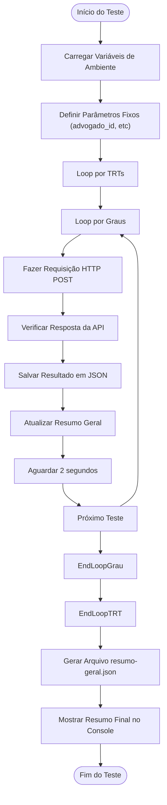

# Testes e Scripts

<cite>
**Arquivos Referenciados neste Documento**   
- [dev_data/scripts/test-api-acervo-geral.ts](file://dev_data/scripts/test-api-acervo-geral.ts)
- [dev_data/scripts/test-api-audiencias.ts](file://dev_data/scripts/test-api-audiencias.ts)
- [dev_data/scripts/test-api-pendentes-manifestacao.ts](file://dev_data/scripts/test-api-pendentes-manifestacao.ts)
- [dev_data/scripts/populate-database.ts](file://dev_data/scripts/populate-database.ts)
- [dev_data/scripts/populate-pendentes-manifestacao.ts](file://dev_data/scripts/populate-pendentes-manifestacao.ts)
- [dev_data/scripts/results/acervo-geral/resumo-geral.json](file://dev_data/scripts/results/acervo-geral/resumo-geral.json)
- [dev_data/scripts/results/api-acervo-geral/resumo-geral.json](file://dev_data/scripts/results/api-acervo-geral/resumo-geral.json)
- [dev_data/scripts/results/api-audiencias/resumo-geral.json](file://dev_data/scripts/results/api-audiencias/resumo-geral.json)
</cite>

## Sumário
1. [Introdução](#introdução)
2. [Estrutura de Scripts de Automação](#estrutura-de-scripts-de-automação)
3. [Scripts de Teste de API](#scripts-de-teste-de-api)
4. [Scripts de População de Banco de Dados](#scripts-de-população-de-banco-de-dados)
5. [Execução de Testes de Captura de Dados](#execução-de-testes-de-captura-de-dados)
6. [Formato dos Resultados](#formato-dos-resultados)
7. [Exemplos de Uso e Validação com PJE/TRT](#exemplos-de-uso-e-validação-com-pjetrt)
8. [Boas Práticas para Escrita de Testes e Scripts](#boas-práticas-para-escrita-de-testes-e-scripts)
9. [Diretrizes para Interpretação de Resultados e Depuração](#diretrizes-para-interpretação-de-resultados-e-depuração)
10. [Conclusão](#conclusão)

## Introdução
Este documento fornece uma análise completa dos testes e scripts de automação do sistema sinesys, com foco nos scripts localizados no diretório `dev_data/scripts/`. O objetivo é orientar desenvolvedores e QAs na validação contínua do sistema, explicando o propósito, a execução e a interpretação dos resultados dos testes automatizados. Os scripts abrangem testes de API para acervo geral, audiências e pendentes de manifestação, além de scripts para população do banco de dados com dados capturados. A documentação detalha o formato dos resultados, exemplos de uso para integração com o PJE/TRT, boas práticas para escrita de novos testes e diretrizes para depuração de falhas.

## Estrutura de Scripts de Automação
O diretório `dev_data/scripts/` contém dois tipos principais de scripts: testes de API e scripts de população de banco de dados. Os testes de API, nomeados como `test-api-*.ts`, simulam requisições HTTP para os endpoints de captura de dados do sistema, permitindo validar a integração com o PJE/TRT. Esses scripts testam a captura de acervo geral, audiências e pendentes de manifestação. Os scripts de população, nomeados como `populate-*.ts`, são responsáveis por processar os resultados desses testes e inserir os dados capturados no banco de dados Supabase, garantindo que os dados estejam disponíveis para análise e uso no sistema. A estrutura de diretórios dentro de `results/` organiza os resultados por tipo de teste e TRT, facilitando a localização e análise dos dados.

**Seção fontes**
- [dev_data/scripts/test-api-acervo-geral.ts](file://dev_data/scripts/test-api-acervo-geral.ts)
- [dev_data/scripts/test-api-audiencias.ts](file://dev_data/scripts/test-api-audiencias.ts)
- [dev_data/scripts/test-api-pendentes-manifestacao.ts](file://dev_data/scripts/test-api-pendentes-manifestacao.ts)
- [dev_data/scripts/populate-database.ts](file://dev_data/scripts/populate-database.ts)
- [dev_data/scripts/populate-pendentes-manifestacao.ts](file://dev_data/scripts/populate-pendentes-manifestacao.ts)

## Scripts de Teste de API
Os scripts de teste de API localizados em `dev_data/scripts/` são projetados para validar a funcionalidade dos endpoints de captura de dados do sistema sinesys. Cada script simula uma requisição externa ao sistema, enviando dados de teste para os endpoints correspondentes e verificando a resposta. O script `test-api-acervo-geral.ts` testa a captura de acervo geral, enviando requisições POST para todos os TRTs em ambos os graus (primeiro e segundo). O script `test-api-audiencias.ts` foca na captura de audiências, testando apenas os TRTs que apresentaram erro em testes anteriores, com um período de data definido de um ano. O script `test-api-pendentes-manifestacao.ts` valida a captura de pendentes de manifestação, testando combinações específicas de TRT e filtro de prazo que falharam anteriormente. Todos os scripts utilizam uma chave de API de serviço para autenticação e geram resultados detalhados em arquivos JSON.

**Seção fontes**
- [dev_data/scripts/test-api-acervo-geral.ts](file://dev_data/scripts/test-api-acervo-geral.ts)
- [dev_data/scripts/test-api-audiencias.ts](file://dev_data/scripts/test-api-audiencias.ts)
- [dev_data/scripts/test-api-pendentes-manifestacao.ts](file://dev_data/scripts/test-api-pendentes-manifestacao.ts)

## Scripts de População de Banco de Dados
Os scripts de população de banco de dados são responsáveis por processar os resultados dos testes de API e inserir os dados capturados na base de dados do sistema. O script `populate-database.ts` processa arquivos JSON de acervo geral e api-acervo-geral, inserindo os dados na tabela `acervo`. Ele verifica a existência de registros duplicados usando uma constraint única e descarta registros já existentes. O script `populate-pendentes-manifestacao.ts` realiza uma função semelhante para os dados de pendentes de manifestação, inserindo-os na tabela `pendentes_manifestacao`. Ambos os scripts percorrem recursivamente os diretórios de resultados, identificando arquivos JSON com prefixo `resultado-`, parseando seu conteúdo e inserindo os dados no banco. Eles geram um relatório final com estatísticas de processamento, incluindo o número de registros inseridos, descartados e erros ocorridos.

**Seção fontes**
- [dev_data/scripts/populate-database.ts](file://dev_data/scripts/populate-database.ts)
- [dev_data/scripts/populate-pendentes-manifestacao.ts](file://dev_data/scripts/populate-pendentes-manifestacao.ts)

## Execução de Testes de Captura de Dados
Para executar os testes de captura de dados, é necessário configurar as variáveis de ambiente necessárias, como `API_BASE_URL` e `SERVICE_API_KEY`, no arquivo `.env.local`. Os testes podem ser executados individualmente ou em sequência, dependendo do tipo de dado a ser capturado. Para testar o acervo geral, execute o comando `ts-node dev_data/scripts/test-api-acervo-geral.ts`. Para testar audiências, use `ts-node dev_data/scripts/test-api-audiencias.ts`, que foca nos TRTs com erros anteriores. Para testar pendentes de manifestação, execute `ts-node dev_data/scripts/test-api-pendentes-manifestacao.ts`, que testa combinações específicas de TRT e filtro. Após a execução bem-sucedida dos testes de API, os scripts de população podem ser executados com `ts-node dev_data/scripts/populate-database.ts` e `ts-node dev_data/scripts/populate-pendentes-manifestacao.ts` para inserir os dados no banco.

**Seção fontes**
- [dev_data/scripts/test-api-acervo-geral.ts](file://dev_data/scripts/test-api-acervo-geral.ts)
- [dev_data/scripts/test-api-audiencias.ts](file://dev_data/scripts/test-api-audiencias.ts)
- [dev_data/scripts/test-api-pendentes-manifestacao.ts](file://dev_data/scripts/test-api-pendentes-manifestacao.ts)
- [dev_data/scripts/populate-database.ts](file://dev_data/scripts/populate-database.ts)
- [dev_data/scripts/populate-pendentes-manifestacao.ts](file://dev_data/scripts/populate-pendentes-manifestacao.ts)

## Formato dos Resultados
Os resultados dos testes são armazenados no diretório `dev_data/scripts/results/` em subdiretórios específicos para cada tipo de teste. Cada execução gera um arquivo JSON com prefixo `resultado-` contendo o timestamp da execução, os dados capturados e metadados como TRT, grau e duração. Além disso, um arquivo `resumo-geral.json` é gerado ao final de cada teste, consolidando as estatísticas de todas as execuções. O resumo inclui o número total de sucessos e falhas, o tempo total de execução e o total de registros capturados. Os arquivos de log, com extensão `.txt`, registram a saída do console durante a execução, fornecendo detalhes sobre cada requisição e possíveis erros. A estrutura dos arquivos JSON é padronizada, facilitando a análise e o processamento automatizado dos resultados.

**Fontes do Diagrama**
- [dev_data/scripts/test-api-acervo-geral.ts](file://dev_data/scripts/test-api-acervo-geral.ts#L1-L269)
- [dev_data/scripts/test-api-audiencias.ts](file://dev_data/scripts/test-api-audiencias.ts#L1-L320)
- [dev_data/scripts/test-api-pendentes-manifestacao.ts](file://dev_data/scripts/test-api-pendentes-manifestacao.ts#L1-L262)

**Seção fontes**
- [dev_data/scripts/test-api-acervo-geral.ts](file://dev_data/scripts/test-api-acervo-geral.ts)
- [dev_data/scripts/test-api-audiencias.ts](file://dev_data/scripts/test-api-audiencias.ts)
- [dev_data/scripts/test-api-pendentes-manifestacao.ts](file://dev_data/scripts/test-api-pendentes-manifestacao.ts)
- [dev_data/scripts/results/acervo-geral/resumo-geral.json](file://dev_data/scripts/results/acervo-geral/resumo-geral.json)
- [dev_data/scripts/results/api-acervo-geral/resumo-geral.json](file://dev_data/scripts/results/api-acervo-geral/resumo-geral.json)
- [dev_data/scripts/results/api-audiencias/resumo-geral.json](file://dev_data/scripts/results/api-audiencias/resumo-geral.json)

## Exemplos de Uso e Validação com PJE/TRT
Os scripts de teste são essenciais para validar a integração contínua com o PJE/TRT. Por exemplo, após uma atualização no sistema, o script `test-api-acervo-geral.ts` pode ser executado para garantir que a captura de acervo geral está funcionando corretamente para todos os TRTs. Se falhas forem detectadas, como no caso do `resumo-geral.json` do acervo-geral que mostra 24 falhas devido à configuração do Supabase ausente, os desenvolvedores podem corrigir a configuração e reexecutar o teste. O script `test-api-audiencias.ts` pode ser usado para validar que a captura de audiências está retornando dados corretos, especialmente para TRTs problemáticos como TRT11, TRT14, TRT16, TRT17, TRT20 e TRT24, que apresentaram erro 500 no teste anterior. Os resultados são então populados no banco de dados para uso nas funcionalidades do sistema.

**Seção fontes**
- [dev_data/scripts/test-api-acervo-geral.ts](file://dev_data/scripts/test-api-acervo-geral.ts)
- [dev_data/scripts/test-api-audiencias.ts](file://dev_data/scripts/test-api-audiencias.ts)
- [dev_data/scripts/test-api-pendentes-manifestacao.ts](file://dev_data/scripts/test-api-pendentes-manifestacao.ts)
- [dev_data/scripts/results/acervo-geral/resumo-geral.json](file://dev_data/scripts/results/acervo-geral/resumo-geral.json)
- [dev_data/scripts/results/api-audiencias/resumo-geral.json](file://dev_data/scripts/results/api-audiencias/resumo-geral.json)

## Boas Práticas para Escrita de Testes e Scripts
Ao escrever novos testes e scripts de automação, siga estas boas práticas: utilize variáveis de ambiente para configurações sensíveis como URLs e chaves de API; implemente tratamento de erros robusto para facilitar a depuração; adicione delays entre requisições para evitar sobrecarga no servidor; e estruture os resultados em formatos padronizados (JSON) para fácil análise. Sempre valide a resposta da API antes de processar os dados. Para scripts de população, verifique a existência de registros duplicados antes da inserção para manter a integridade dos dados. Documente claramente o propósito e os parâmetros de cada script. Utilize timestamps nos nomes dos arquivos de resultado para evitar sobrescrita e permitir o histórico de execuções.

**Seção fontes**
- [dev_data/scripts/test-api-acervo-geral.ts](file://dev_data/scripts/test-api-acervo-geral.ts)
- [dev_data/scripts/test-api-audiencias.ts](file://dev_data/scripts/test-api-audiencias.ts)
- [dev_data/scripts/test-api-pendentes-manifestacao.ts](file://dev_data/scripts/test-api-pendentes-manifestacao.ts)
- [dev_data/scripts/populate-database.ts](file://dev_data/scripts/populate-database.ts)
- [dev_data/scripts/populate-pendentes-manifestacao.ts](file://dev_data/scripts/populate-pendentes-manifestacao.ts)

## Diretrizes para Interpretação de Resultados e Depuração
Para interpretar os resultados dos testes, examine o arquivo `resumo-geral.json` para obter uma visão geral do sucesso e falhas. Um alto número de falhas pode indicar problemas de configuração, como a ausência de variáveis de ambiente do Supabase, ou erros no servidor (ex: erro 500). Os arquivos de log fornecem detalhes sobre cada requisição, ajudando a identificar o ponto exato da falha. Para depurar, verifique as variáveis de ambiente, a conectividade com o servidor e a estrutura dos dados esperados. Se um teste falhar, execute-o individualmente para isolar o problema. Após corrigir o problema, reexecute o teste e verifique se os resultados foram atualizados corretamente no banco de dados através dos scripts de população.

**Seção fontes**
- [dev_data/scripts/results/acervo-geral/resumo-geral.json](file://dev_data/scripts/results/acervo-geral/resumo-geral.json)
- [dev_data/scripts/results/api-acervo-geral/resumo-geral.json](file://dev_data/scripts/results/api-acervo-geral/resumo-geral.json)
- [dev_data/scripts/results/api-audiencias/resumo-geral.json](file://dev_data/scripts/results/api-audiencias/resumo-geral.json)

## Conclusão
Os testes e scripts de automação no sistema sinesys são ferramentas essenciais para garantir a integridade e a funcionalidade contínua da integração com o PJE/TRT. Esta documentação fornece um guia completo para entender, executar e manter esses scripts, cobrindo desde a estrutura básica até exemplos práticos de uso e diretrizes de depuração. Ao seguir as boas práticas descritas, desenvolvedores e QAs podem efetivamente validar o sistema, garantindo que os dados de acervo geral, audiências e pendentes de manifestação sejam capturados e armazenados corretamente. A automação desses processos não apenas aumenta a confiabilidade do sistema, mas também otimiza o tempo de desenvolvimento e testes.