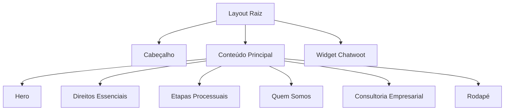
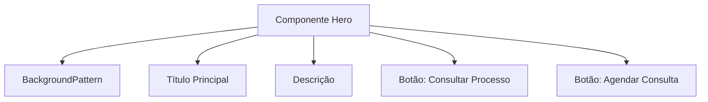
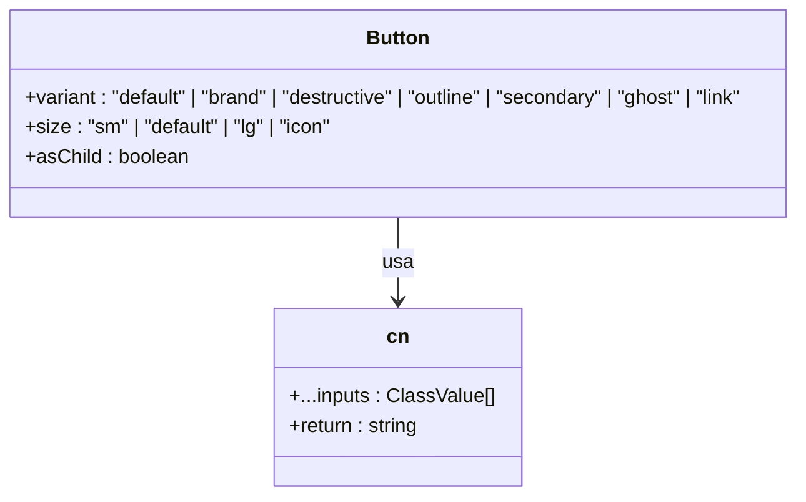

# Visão Geral do Projeto

<cite>
**Arquivos Referenciados neste Documento**  
- [README.md](file://README.md) - *Atualizado no commit 36eb3c1: atualizar dependências para Next.js 16 e aprimorar npm scripts*
- [app/layout.tsx](file://app/layout.tsx) - *Atualizado no commit 36eb3c1: atualizar dependências para Next.js 16 e aprimorar npm scripts*
- [components/hero.tsx](file://components/hero.tsx)
- [components/direitos-essenciais.tsx](file://components/direitos-essenciais.tsx)
- [components/etapas-processuais.tsx](file://components/etapas-processuais.tsx)
- [components/quem-somos.tsx](file://components/quem-somos.tsx)
- [app/page.tsx](file://app/page.tsx)
- [components/ui/button.tsx](file://components/ui/button.tsx)
- [lib/utils.ts](file://lib/utils.ts)
- [next.config.ts](file://next.config.ts)
- [tsconfig.json](file://tsconfig.json)
- [package.json](file://package.json)
</cite>

## Resumo das Atualizações
**Alterações Realizadas**   
- Atualização do nome do escritório de "Polastri e Zattar Advogados" para "Zattar Advogados" em todo o documento
- Revisão de todas as referências institucionais, metadados e identidade visual
- Atualização dos arquivos de origem para refletir as mudanças na marca
- Atualização da stack tecnológica para Next.js 16 e React 19
- Manutenção da estrutura conceitual e técnica do projeto

## Sumário
1. [Introdução](#introdução)
2. [Missão, Valores e Público-Alvo](#missão-valores-e-público-alvo)
3. [Visão Conceitual do Projeto](#visão-conceitual-do-projeto)
4. [Estrutura da Aplicação](#estrutura-da-aplicação)
5. [Análise de Componentes Principais](#análise-de-componentes-principais)
6. [Arquitetura Técnica](#arquitetura-técnica)
7. [Conclusão](#conclusão)

## Introdução

O site institucional do escritório **Zattar Advogados** é uma plataforma digital moderna e responsiva, projetada para informar sobre direitos trabalhistas, apresentar serviços jurídicos nas áreas de Direito do Trabalho, Civil e Empresarial, e facilitar o contato com clientes. A aplicação é construída com tecnologias atuais e boas práticas de desenvolvimento web, priorizando acessibilidade, desempenho e experiência do usuário.

**Seção fontes**
- [README.md](file://README.md#L1-L40)

## Missão, Valores e Público-Alvo

O escritório tem como missão **"Garantir Direitos para um Mundo mais Justo"**, atuando com mais de 15 anos de experiência na defesa dos trabalhadores. O público-alvo principal inclui trabalhadores individuais que enfrentam violações de direitos, bem como empresas que buscam consultoria preventiva e alinhamento com a legislação trabalhista.

Os valores de marca são claramente refletidos na comunicação e na estrutura do site:

- **Inovação**: Uso de tecnologia avançada (Next.js 16, App Router, React Server Components) e abordagem moderna para a advocacia, especialmente na defesa de trabalhadores de plataformas digitais.
- **Segurança**: Linguagem clara sobre direitos garantidos por lei, uso de design confiável e comunicação transparente.
- **Estratégia**: Explicação detalhada das etapas processuais, demonstrando planejamento e expertise técnica.
- **Agilidade**: Chamadas para ação diretas (como "Agendar Consulta") e integração com chat ao vivo via Chatwoot.

Esses valores são estruturados em torno dos cinco pilares de atuação do escritório: Nossa Causa, Vanguarda em Apps, Vínculo Empregatício, Atuação Completa e Consultoria Preventiva.

**Seção fontes**
- [README.md](file://README.md#L5-L15)
- [components/quem-somos.tsx](file://components/quem-somos.tsx#L1-L236)

## Visão Conceitual do Projeto

O site é organizado como uma jornada narrativa que guia o visitante desde a conscientização sobre direitos até a ação (contato com o escritório). A estrutura é linear e intuitiva:

1. **Hero**: Apresentação impactante com o slogan central.
2. **Direitos Essenciais**: Educação sobre direitos fundamentais.
3. **Etapas Processuais**: Explicação do processo jurídico.
4. **Quem Somos**: Apresentação dos pilares de atuação.
5. **Consultoria Empresarial**: Serviços para empresas.
6. **Footer**: Informações de contato e links.

Essa estrutura reflete uma abordagem pedagógica e empática, essencial para um escritório que atua em áreas sensíveis como direitos trabalhistas.

**Seção fontes**
- [app/page.tsx](file://app/page.tsx#L8-L20)

## Estrutura da Aplicação

A aplicação utiliza o **Next.js 16 com App Router**, o que permite uma arquitetura baseada em diretórios com roteamento automático. A estrutura de pastas é clara e modular:

- `app/`: Contém o roteamento da aplicação (`page.tsx`, `layout.tsx`, `globals.css`).
- `components/`: Componentes React reutilizáveis, divididos entre componentes de UI genéricos e componentes específicos da aplicação.
- `lib/`: Utilitários compartilhados, como a função `cn` para manipulação de classes.
- `public/`: Assets estáticos (não listados, mas inferidos).

O componente `layout.tsx` define o layout raiz da aplicação, incluindo a fonte Geist e o widget de chat do Chatwoot, que é carregado em todas as páginas.

**Fontes do Diagrama**
- [app/layout.tsx](file://app/layout.tsx#L1-L40)
- [app/page.tsx](file://app/page.tsx#L8-L20)

**Seção fontes**
- [app/page.tsx](file://app/page.tsx#L8-L20)
- [app/layout.tsx](file://app/layout.tsx#L1-L40)

## Análise de Componentes Principais

### Componente Hero

O componente `Hero` é a primeira impressão do site. Ele utiliza um fundo com padrão visual sutil (`BackgroundPattern`) e apresenta uma mensagem central sobre a dignidade no trabalho. Inclui dois botões de chamada para ação: "Consultar Processo" e "Agendar Consulta", facilitando a conversão de visitantes em leads.

**Fontes do Diagrama**
- [components/hero.tsx](file://components/hero.tsx#L5-L40)

**Seção fontes**
- [components/hero.tsx](file://components/hero.tsx#L5-L40)

### Componente Direitos Essenciais

O componente `DireitosEssenciais` lista nove direitos trabalhistas fundamentais, como Carteira Assinada, 13º Salário e FGTS. Cada direito é apresentado com um ícone temático, título e descrição curta. Os itens são organizados em um grid responsivo (2 colunas em tablets, 3 em desktops) e são clicáveis, sugerindo navegação para páginas detalhadas.

**Seção fontes**
- [components/direitos-essenciais.tsx](file://components/direitos-essenciais.tsx#L1-L130)

### Componente Etapas Processuais

Este componente visualiza o fluxo processual trabalhista em cinco etapas: Petição Inicial, Audiência, Conciliação, Recurso e Tribunais Superiores. Utiliza o componente `BentoGrid` para layout e `framer-motion` para animações sutis que indicam atividade (como pulsação em uma audiência). Cada etapa combina um ícone, título, descrição e um gráfico animado que simboliza a fase.

**Seção fontes**
- [components/etapas-processuais.tsx](file://components/etapas-processuais.tsx#L1-L334)

## Arquitetura Técnica

### Stack Tecnológica

- **Framework**: Next.js 16.0.0 com App Router e React 19.
- **Linguagem**: TypeScript com modo estrito (`"strict": true`).
- **Estilização**: TailwindCSS v4 com design tokens personalizados (cores, bordas, sombras).
- **Design System**: Combinação de **shadcn/ui** (componentes base como Button, Card) e **MynaUI** (ícones e tokens visuais).
- **Gerenciamento de Estado**: React hooks (`useState`) para interatividade simples.
- **Animações**: `framer-motion` para microinterações.

### Configurações-Chave

- **TypeScript**: Configurado com módulos ES, resolução de módulos do bundler e caminhos absolutos (`@/*`).
- **Next.js**: Habilita imagens remotas do Unsplash e usa o modo standalone para deploy.
- **TailwindCSS**: Configurado para varredura de conteúdo em `app/`, `components/` e `pages/`.
- **Utilitários**: Função `cn` combina `clsx` e `tailwind-merge` para fusão segura de classes.

**Fontes do Diagrama**
- [components/ui/button.tsx](file://components/ui/button.tsx#L44-L55)
- [lib/utils.ts](file://lib/utils.ts#L3-L5)

**Seção fontes**
- [package.json](file://package.json#L1-L45)
- [tsconfig.json](file://tsconfig.json#L1-L27)
- [next.config.ts](file://next.config.ts#L1-L17)
- [components/ui/button.tsx](file://components/ui/button.tsx#L1-L59)
- [lib/utils.ts](file://lib/utils.ts#L1-L6)

## Conclusão

O site do escritório Zattar Advogados é um exemplo bem-sucedido de integração entre propósito institucional e tecnologia moderna. Ele cumpre eficazmente seu objetivo de informar, educar e converter visitantes, tudo enquanto reflete os valores de inovação, segurança, estratégia e agilidade. A arquitetura baseada em Next.js 16, TypeScript e TailwindCSS garante manutenibilidade, desempenho e escalabilidade, enquanto o design system unificado (MynaUI + shadcn/ui) assegura consistência visual e experiência de usuário de alta qualidade.