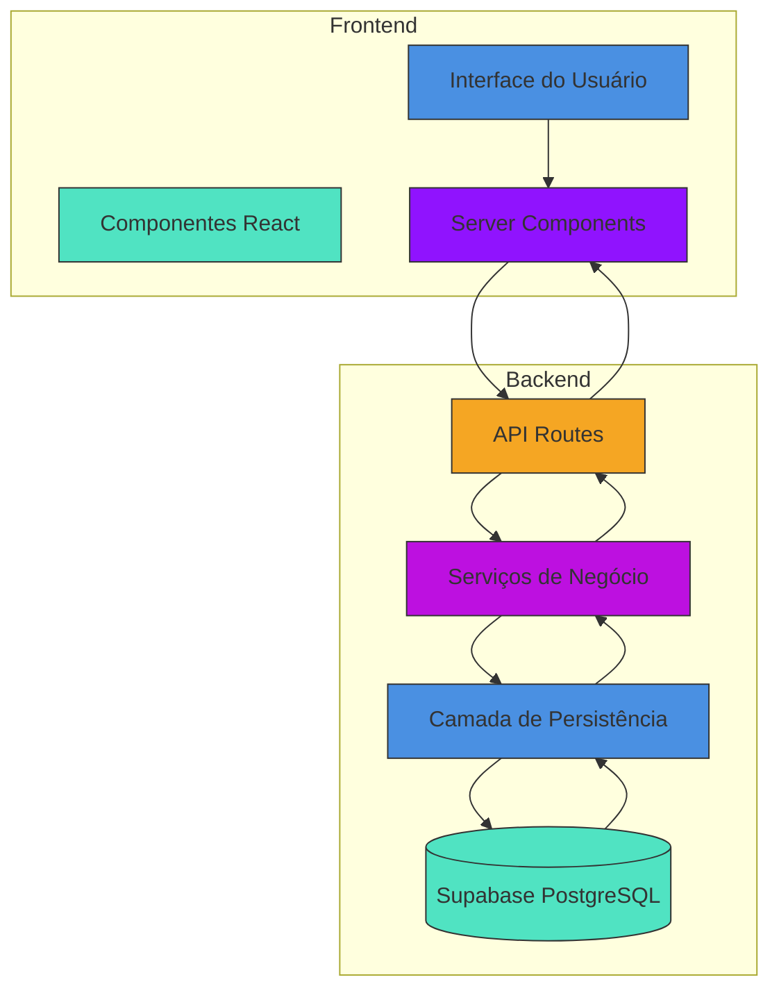
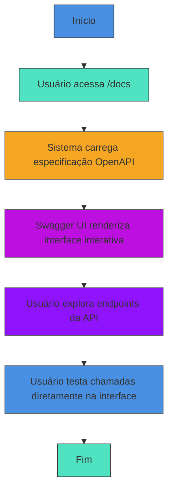
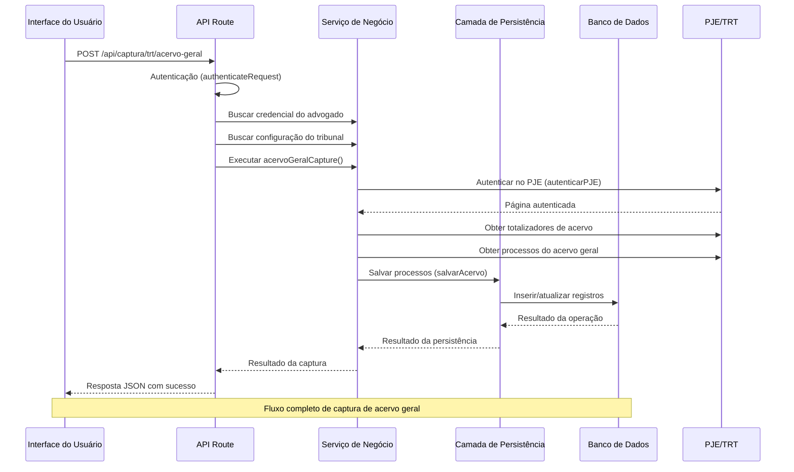

# Visão Geral do Sistema

<cite>
**Arquivos Referenciados neste Documento**  
- [project.md](file://openspec/project.md)
- [README.md](file://README.md)
- [swagger.config.ts](file://swagger.config.ts)
- [app/api/captura/trt/acervo-geral/route.ts](file://app/api/captura/trt/acervo-geral/route.ts)
- [backend/captura/services/trt/acervo-geral.service.ts](file://backend/captura/services/trt/acervo-geral.service.ts)
- [backend/captura/services/persistence/acervo-persistence.service.ts](file://backend/captura/services/persistence/acervo-persistence.service.ts)
- [supabase/schemas/04_acervo.sql](file://supabase/schemas/04_acervo.sql)
- [supabase/schemas/06_pendentes_manifestacao.sql](file://supabase/schemas/06_pendentes_manifestacao.sql)
- [app/docs/page.tsx](file://app/docs/page.tsx)
- [app/api/docs/openapi.json/route.ts](file://app/api/docs/openapi.json/route.ts)
- [backend/utils/auth/api-auth.ts](file://backend/utils/auth/api-auth.ts)
- [backend/utils/supabase/service-client.ts](file://backend/utils/supabase/service-client.ts)
</cite>

## Sumário
1. [Introdução](#introdução)
2. [Arquitetura do Sistema](#arquitetura-do-sistema)
3. [Principais Módulos do Sistema](#principais-módulos-do-sistema)
4. [Casos de Uso Principais](#casos-de-uso-principais)
5. [Fluxo de Dados e Integração](#fluxo-de-dados-e-integração)
6. [Decisões de Arquitetura](#decisões-de-arquitetura)
7. [Documentação da API](#documentação-da-api)
8. [Conclusão](#conclusão)

## Introdução

O sistema **Sinesys** é uma aplicação full-stack desenvolvida para automação da captura e gestão de dados processuais do Poder Judiciário Eletrônico (PJE), com foco específico nos Tribunais Regionais do Trabalho (TRTs). O sistema foi projetado para atender às necessidades de escritórios de advocacia, oferecendo uma solução integrada para gestão de clientes, contratos, processos jurídicos e monitoramento de pendências.

A principal finalidade do Sinesys é eliminar a necessidade de acesso manual ao PJE, automatizando a coleta de dados de processos judiciais e centralizando essas informações em uma plataforma unificada. Isso permite que advogados e gestores tenham uma visão completa do acervo processual, com atualizações em tempo real e atribuição clara de responsabilidades.

O sistema é construído com tecnologias modernas e segue práticas de desenvolvimento robustas, garantindo segurança, escalabilidade e manutenibilidade. A integração entre frontend e backend é feita de forma eficiente, com uma clara separação de responsabilidades entre as camadas de aplicação.

**Fontes da seção**
- [project.md](file://openspec/project.md#L1-L180)
- [README.md](file://README.md#L1-L37)

## Arquitetura do Sistema

A arquitetura do Sinesys é baseada em uma estrutura full-stack moderna, utilizando Next.js como framework principal para o frontend e backend, com uma clara separação entre as camadas de apresentação, lógica de negócio e persistência.

### Frontend (Next.js App Router)

O frontend é construído com **Next.js 16** utilizando o **App Router**, que permite a utilização de **Server Components** e **Server Actions**. Esta abordagem oferece vantagens significativas em termos de desempenho, segurança e experiência do usuário.

A interface de usuário é composta por componentes React reutilizáveis, utilizando a biblioteca **shadcn/ui** baseada em **Radix UI**, que garante acessibilidade e consistência visual. O estilamento é feito com **Tailwind CSS v4**, utilizando uma abordagem utility-first que acelera o desenvolvimento e mantém a consistência do design.

### Backend (TypeScript com Supabase)

O backend é implementado em **TypeScript** com uma arquitetura de serviços bem definida. Os endpoints da API são criados como **Next.js API Routes** no App Router, seguindo padrões RESTful.

A persistência de dados é feita com **Supabase**, um banco de dados PostgreSQL com recursos avançados de segurança, incluindo **Row Level Security (RLS)**. O Supabase também fornece autenticação e autorização integradas, simplificando o gerenciamento de usuários e permissões.

A comunicação entre frontend e backend é feita através de chamadas HTTP para os endpoints da API, com autenticação obrigatória via JWT (Bearer Token) ou sessão do Supabase.



**Fontes do diagrama**
- [project.md](file://openspec/project.md#L11-L180)
- [package.json](file://package.json#L1-L39)

**Fontes da seção**
- [project.md](file://openspec/project.md#L11-L180)
- [package.json](file://package.json#L1-L39)

## Principais Módulos do Sistema

O Sinesys é organizado em módulos funcionais que refletem as principais áreas de atuação de um escritório de advocacia. Cada módulo possui uma estrutura bem definida de serviços e persistência, garantindo coesão e baixo acoplamento.

### Módulo de Captura de Dados

O módulo de captura é o coração do sistema, responsável por automatizar a coleta de dados do PJE/TRT. Ele utiliza tecnologias de automação web como **Puppeteer** ou **Playwright** para acessar o sistema do tribunal, autenticar-se e extrair informações processuais.

A captura é realizada para diferentes tipos de dados:
- **Acervo geral**: Processos ativos do advogado
- **Processos arquivados**: Processos encerrados
- **Audiências**: Eventos processuais agendados
- **Pendências de manifestação**: Ações que requerem resposta do advogado

O sistema suporta todos os 24 TRTs brasileiros, com configurações específicas para cada tribunal e grau processual (primeiro ou segundo grau).

### Módulo de Gestão de Contratos

Este módulo permite o cadastro e gerenciamento de contratos de prestação de serviços jurídicos. Os contratos podem ser de diferentes tipos, incluindo ajuizamento, defesa, ato processual, assessoria, consultoria, extrajudicial e parecer.

Cada contrato pode estar vinculado a múltiplos processos judiciais, permitindo um acompanhamento completo da atuação do escritório em cada caso.

### Módulo de Gestão de Clientes

O sistema permite o cadastro de clientes, que podem ser pessoas físicas (PF) ou jurídicas (PJ). As informações dos clientes são armazenadas com conformidade à LGPD, garantindo a proteção de dados pessoais.

O módulo inclui funcionalidades de busca por CPF ou CNPJ, facilitando a identificação e vinculação de clientes a processos e contratos.

### Módulo de Partes Contrárias

Este módulo registra as partes contrárias nos processos judiciais. Assim como os clientes, as partes contrárias podem ser PF ou PJ, e podem ser buscadas por CPF ou CNPJ.

A gestão de partes contrárias permite uma análise mais completa dos processos, identificando padrões e estratégias de atuação de opositores frequentes.

### Módulo de Pendentes de Manifestação

Um dos módulos mais críticos do sistema, responsável por monitorar processos que exigem manifestação do advogado dentro de prazos legais. O sistema alerta sobre pendências com e sem prazo, permitindo a atribuição de responsáveis e o acompanhamento do cumprimento de prazos.

A funcionalidade de pendentes de manifestação é essencial para evitar prejuízos processuais decorrentes de perda de prazos.

**Fontes da seção**
- [project.md](file://openspec/project.md#L113-L140)
- [supabase/schemas/](file://supabase/schemas/)

## Casos de Uso Principais

O Sinesys atende a diversos casos de uso essenciais para a operação de um escritório de advocacia moderno.

### Monitoramento de Processos

O caso de uso principal é o monitoramento contínuo de processos judiciais. O sistema realiza capturas automáticas dos dados do PJE/TRT em intervalos regulares, atualizando o acervo processual com novas movimentações, decisões e alterações de status.

Os advogados podem visualizar todos os seus processos em uma interface unificada, sem a necessidade de acessar individualmente cada sistema do tribunal.

### Atribuição de Responsáveis

O sistema permite a atribuição de responsáveis por processos e pendências de manifestação. Isso garante que cada tarefa tenha um advogado claramente designado, facilitando a gestão de equipe e o acompanhamento de desempenho.

A atribuição é registrada com auditoria, criando um histórico completo de quem foi responsável por cada processo em cada período.

### Geração de Documentação API via Swagger

O Sinesys inclui documentação completa da API em formato OpenAPI (Swagger), acessível através da rota `/docs`. Esta documentação é gerada automaticamente a partir das anotações JSDoc nos endpoints da API.

A documentação Swagger permite que desenvolvedores externos ou integradores compreendam facilmente como interagir com a API do sistema, facilitando integrações e automações.



**Fontes do diagrama**
- [app/docs/page.tsx](file://app/docs/page.tsx#L1-L68)
- [app/api/docs/openapi.json/route.ts](file://app/api/docs/openapi.json/route.ts#L1-L23)

**Fontes da seção**
- [swagger.config.ts](file://swagger.config.ts#L1-L48)
- [app/docs/page.tsx](file://app/docs/page.tsx#L1-L68)
- [app/api/docs/openapi.json/route.ts](file://app/api/docs/openapi.json/route.ts#L1-L23)

## Fluxo de Dados e Integração

O fluxo de dados no Sinesys é bem definido, começando na interface do usuário e terminando na persistência no banco de dados.

### Fluxo de Captura de Acervo Geral

Quando um usuário solicita a captura do acervo geral, o seguinte fluxo é executado:



**Fontes do diagrama**
- [app/api/captura/trt/acervo-geral/route.ts](file://app/api/captura/trt/acervo-geral/route.ts#L1-L162)
- [backend/captura/services/trt/acervo-geral.service.ts](file://backend/captura/services/trt/acervo-geral.service.ts#L1-L121)
- [backend/captura/services/persistence/acervo-persistence.service.ts](file://backend/captura/services/persistence/acervo-persistence.service.ts#L1-L234)

**Fontes da seção**
- [app/api/captura/trt/acervo-geral/route.ts](file://app/api/captura/trt/acervo-geral/route.ts#L1-L162)
- [backend/captura/services/trt/acervo-geral.service.ts](file://backend/captura/services/trt/acervo-geral.service.ts#L1-L121)
- [backend/captura/services/persistence/acervo-persistence.service.ts](file://backend/captura/services/persistence/acervo-persistence.service.ts#L1-L234)

## Decisões de Arquitetura

O Sinesys incorpora várias decisões de arquitetura estratégicas que garantem sua robustez, segurança e escalabilidade.

### Separação Clara entre Camadas

O sistema adota uma arquitetura de camadas bem definida:
- **API Routes**: Responsável pela validação de entrada, autenticação e formatação de resposta
- **Serviços de Negócio**: Contém a lógica de negócio pura, sem dependência direta do framework
- **Persistência**: Camada dedicada ao acesso ao banco de dados, isolando a lógica de negócio dos detalhes de implementação do banco

Essa separação permite testes mais fáceis, manutenção mais simples e maior reutilização de código.

### Uso de RLS no Supabase

O **Row Level Security (RLS)** é uma característica fundamental do Supabase que foi amplamente utilizada no Sinesys. O RLS garante que os dados sejam acessados apenas por usuários autorizados, com políticas granulares por operação (SELECT, INSERT, UPDATE, DELETE).

As políticas de RLS são definidas no banco de dados, garantindo que mesmo se houver uma falha na camada de aplicação, os dados permaneçam protegidos.

### Autenticação Múltipla

O sistema implementa um mecanismo de autenticação dual que suporta três métodos:
1. **Service API Key**: Para jobs do sistema e processos agendados
2. **Bearer Token (JWT)**: Para chamadas de API externas
3. **Sessão do Supabase**: Para interações do frontend

Esta abordagem flexível permite que diferentes tipos de clientes (usuários, sistemas, jobs) se autentiquem de forma apropriada.

```mermaid
classDiagram
class authenticateRequest {
+authenticateRequest(request : NextRequest) AuthResult
}
class createServiceClient {
+createServiceClient() SupabaseClient
}
class AuthResult {
+authenticated : boolean
+userId? : string
+usuarioId? : number
+source? : 'session' | 'bearer' | 'service'
}
authenticateRequest --> AuthResult : "retorna"
createServiceClient --> Supabase : "cria cliente com secret key"
note right of authenticateRequest
Função de autenticação que verifica
Service API Key, Bearer Token e Sessão do Supabase
end note
note right of createServiceClient
Cliente com secret key para operações
administrativas que bypassam RLS
end note
```

**Fontes do diagrama**
- [backend/utils/auth/api-auth.ts](file://backend/utils/auth/api-auth.ts#L1-L135)
- [backend/utils/supabase/service-client.ts](file://backend/utils/supabase/service-client.ts#L1-L51)

**Fontes da seção**
- [backend/utils/auth/api-auth.ts](file://backend/utils/auth/api-auth.ts#L1-L135)
- [backend/utils/supabase/service-client.ts](file://backend/utils/supabase/service-client.ts#L1-L51)

## Documentação da API

A documentação da API é uma característica importante do Sinesys, facilitando a integração e o uso da API por desenvolvedores.

### Geração Automática com Swagger

A documentação é gerada automaticamente usando **swagger-jsdoc**, que extrai anotações JSDoc dos endpoints da API para criar uma especificação OpenAPI 3.0. Esta especificação é então servida como JSON e renderizada com **swagger-ui-react**.

A documentação inclui:
- Descrição completa de todos os endpoints
- Parâmetros de entrada e exemplos
- Códigos de status e respostas esperadas
- Esquemas de segurança (Bearer Token, sessão, API Key)

### Acesso à Documentação

A documentação está disponível em duas formas:
1. **Interface interativa**: Acessível em `/docs`, permite testar endpoints diretamente no navegador
2. **Especificação JSON**: Disponível em `/api/docs/openapi.json`, útil para integrações automatizadas

A documentação é atualizada automaticamente com cada alteração nos endpoints, garantindo que sempre reflita o estado atual da API.

**Fontes da seção**
- [swagger.config.ts](file://swagger.config.ts#L1-L48)
- [app/docs/page.tsx](file://app/docs/page.tsx#L1-L68)
- [app/api/docs/openapi.json/route.ts](file://app/api/docs/openapi.json/route.ts#L1-L23)

## Conclusão

O sistema Sinesys representa uma solução completa e moderna para a automação da gestão processual em escritórios de advocacia. Com sua arquitetura full-stack baseada em Next.js e Supabase, o sistema oferece uma combinação poderosa de desempenho, segurança e facilidade de desenvolvimento.

A clara separação entre camadas, o uso estratégico de RLS no Supabase e a documentação abrangente da API tornam o Sinesys uma plataforma robusta e sustentável. A automação da captura de dados do PJE/TRT elimina tarefas repetitivas e reduz o risco de erros humanos, permitindo que os advogados se concentrem em atividades de maior valor.

Para desenvolvedores, o sistema oferece uma base técnica sólida com boas práticas de desenvolvimento, tipagem rigorosa em TypeScript e uma arquitetura modular que facilita a manutenção e expansão. Para usuários finais, a interface intuitiva e os fluxos de trabalho bem definidos proporcionam uma experiência de uso eficiente e produtiva.

O Sinesys demonstra como tecnologias modernas podem ser aplicadas para resolver desafios complexos no setor jurídico, trazendo inovação e eficiência para a prática da advocacia.