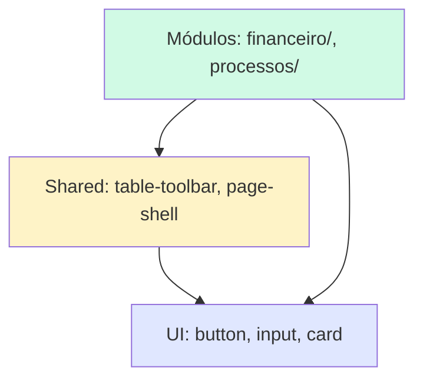

```
src/
├── components/
│   ├── ui/                    # Primitivos shadcn (NÃO EDITAR LOGICAMENTE)
│   │   ├── button.tsx
│   │   ├── input.tsx
│   │   └── card.tsx
│   ├── shared/                # Componentes reutilizáveis do projeto
│   │   ├── table-toolbar.tsx  # Toolbar de filtros para tabelas
│   │   ├── responsive-table.tsx # Wrapper de tabela responsiva
│   │   ├── page-shell.tsx     # Layout padrão de página
│   │   └── stat-card.tsx      # Card de estatística (Dashboard)
│   └── [módulo]/              # Componentes específicos de negócio
│       ├── financeiro/
│       │   ├── dre-card.tsx
│       │   └── lancamento-form.tsx
│       └── processos/
│           └── timeline-view.tsx
```

## Regras de organização:
- **Primitivos (`ui/`):** Componentes shadcn/ui puros. Agentes NÃO devem modificar a lógica, apenas usar.
- **Shared (`shared/`):** Componentes reutilizáveis em múltiplos módulos. Devem ser agnósticos de negócio.
- **Módulos (`[módulo]/`):** Componentes específicos de domínio. Podem importar de `ui/` e `shared/`.

## Diagrama de dependências:

