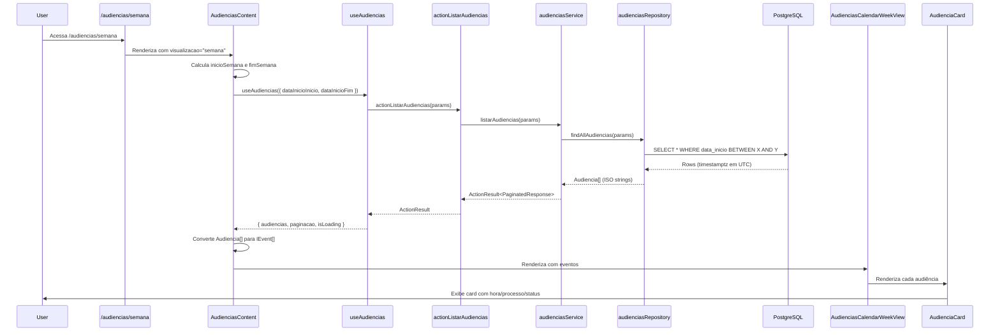

# Módulo: Audiências

Este documento detalha o módulo de Audiências do sistema Sinesys, cobrindo sua arquitetura, fluxo de dados, validações e componentes UI.

## 1. Visão Geral

O módulo de Audiências permite o gerenciamento completo de audiências, incluindo criação, visualização (em formato de lista, semana, mês e ano), atualização de status e integração com dados de processos. Ele segue o padrão arquitetural **Core/Adapter/UI** e reutiliza componentes de calendário existentes para uma experiência de usuário consistente.

## 2. Arquitetura

### Core Layer (`src/core/audiencias`)

Contém a lógica de negócio central, independente de frameworks ou interfaces.

-   **`domain.ts`**: Define interfaces (`Audiencia`, `EnderecoPresencial`), enums (`StatusAudiencia`, `ModalidadeAudiencia`, `GrauTribunal`), constantes (`CODIGO_TRIBUNAL`) e schemas de validação Zod (`createAudienciaSchema`, `updateAudienciaSchema`).
-   **`repository.ts`**: Responsável pela interação com o banco de dados (Supabase/PostgreSQL). Implementa funções CRUD (`findAudienciaById`, `findAllAudiencias`, `saveAudiencia`, `updateAudiencia`, `atualizarStatus`) e validações de existência de FKs (`processoExists`, `tipoAudienciaExists`). Inclui lógica para conversão entre `snake_case` (DB) e `camelCase` (aplicação).
-   **`service.ts`**: Contém a lógica de negócio principal, aplicando validações e orquestrando as operações do repositório. Funções como `criarAudiencia`, `buscarAudiencia`, `listarAudiencias` e `atualizarStatusAudiencia` residem aqui. Realiza validações de negócio adicionais (ex: `dataFim` > `dataInicio`, URL válida).
-   **`index.ts`**: Ponto de entrada do módulo Core, exportando as interfaces públicas e uma instância do `AudienciasService` para injeção de dependência simplificada.

### Adapter Layer (`src/app/actions`)

Atua como ponte entre a UI e a Core Layer, expondo a funcionalidade da Core através de Server Actions.

-   **`audiencias.ts`**: Implementa as Next.js Server Actions para as operações de audiência. As ações incluem `actionCriarAudiencia`, `actionAtualizarAudiencia`, `actionAtualizarStatusAudiencia` e `actionListarAudiencias`. Elas são responsáveis por:
    *   Extrair e parsear dados do `FormData`.
    *   Validar dados usando os schemas Zod da Core Layer.
    *   Chamar os métodos correspondentes no `AudienciasService`.
    *   Revalidar os paths do cache do Next.js (`revalidatePath`) após operações de escrita.
    *   Formatar as respostas para `ActionResult` (sucesso/erro).

### UI Layer (`src/components/modules/audiencias` e `src/app/(dashboard)/audiencias`)

Consiste nos componentes React que interagem com as Server Actions e apresentam os dados ao usuário.

-   **`audiencias-content.tsx`**: Componente principal que gerencia o estado da visualização (semana, mês, ano, lista) e os filtros de busca. Utiliza o `useAudiencias` hook para buscar dados e renderiza o componente de visualização apropriado.
-   **`audiencias-list-view.tsx`**: Exibe as audiências em formato de tabela, utilizando o `DataTable` da `shadcn/ui`. Inclui colunas para data, processo, tipo, partes, modalidade, responsável e ações.
-   **`audiencias-calendar-week-view.tsx`**: Reutiliza a estrutura de calendário semanal, adaptando-a para exibir `AudienciaCard`s nas células de tempo.
-   **`audiencias-calendar-month-view.tsx`**: Reutiliza a estrutura de calendário mensal, exibindo `AudienciaCard`s compactos e contagens de audiências por dia. Permite navegação para o dia/mês específico.
-   **`audiencias-calendar-year-view.tsx`**: Reutiliza a estrutura de calendário anual, exibindo uma visão geral dos meses com a contagem de audiências por dia. Clicar em um mês navega para a visualização mensal.
-   **`audiencia-card.tsx`**: Componente compacto para exibir informações essenciais de uma audiência em visualizações de calendário e lista.
-   **`audiencia-form.tsx`**: Formulário para criação e edição de audiências, com validação Zod e integração com Server Actions. Inclui campos para processo, datas, tipo, modalidade, URL virtual, endereço presencial, responsável e observações.
-   **`audiencia-detail-sheet.tsx`**: Um `Sheet` lateral que exibe todos os detalhes de uma audiência selecionada.
-   **`audiencia-status-badge.tsx`**: Componente visual para exibir o status da audiência com cores distintas (Marcada, Finalizada, Cancelada).
-   **`audiencia-modalidade-badge.tsx`**: Componente visual para exibir a modalidade da audiência com ícones e cores (Virtual, Presencial, Híbrida).
-   **`audiencias-month-day-cell.tsx`**: Célula para a visualização mensal que exibe o dia, a contagem de audiências e botões de ação.
-   **Pages (`src/app/(dashboard)/audiencias/*`)**: As páginas de roteamento (`semana`, `mes`, `ano`, `lista`) são client-side components que apenas renderizam o `AudienciasContent` com a prop `visualizacao` adequada.

### Hooks Customizados (`src/hooks`)

Facilitam a busca e o gerenciamento de dados de audiências e seus tipos.

-   **`use-audiencias.ts`**: Hook para buscar e paginar audiências, utilizando `actionListarAudiencias` e incluindo debounce para otimizar chamadas de API.
-   **`use-tipos-audiencias.ts`**: Hook para buscar tipos de audiência do endpoint `/api/audiencias/tipos`.

## 3. Fluxo de Dados (Exemplo: Visualização Semanal)

## 4. Validações e Tratamento de Timezone

-   **Validação de Schemas**: Todos os dados de entrada para criação/atualização são validados no `domain.ts` usando Zod e aplicados no `service.ts` e nas `Server Actions`.
-   **Integridade Referencial**: O `service.ts` verifica a existência de `processoId` e `tipoAudienciaId` antes de persistir dados.
-   **Validação de Links Virtuais**: URLs de audiências virtuais são validadas quanto ao formato (`.url()`) e ao protocolo HTTPS.
-   **Consistência de Datas**: A `dataFim` é validada para ser posterior à `dataInicio`.
-   **Tratamento de Timezone**:
    *   O PostgreSQL armazena timestamps em UTC (`timestamptz`).
    *   O Supabase retorna strings ISO formatadas com timezone (e.g., `2025-03-15T14:30:00.000Z`).
    *   No frontend, `new Date(isoString)` é usado para converter automaticamente para o timezone local do navegador, garantindo a exibição correta sem conversões manuais.

## 5. Performance

-   **Otimização de Queries**: O `repository.ts` utiliza filtros de range de data com `gte` e `lte` em colunas indexadas (`data_inicio`, `data_fim`) para consultas eficientes, especialmente em visualizações de calendário.
-   **Paginação**: A listagem de audiências suporta paginação para evitar o carregamento excessivo de dados.
-   **Debounce**: O hook `useAudiencias` aplica debounce aos parâmetros de busca para reduzir chamadas desnecessárias à API durante a digitação.

## 6. Testes

-   **Testes de Unidade/Serviço**: `src/core/audiencias/__tests__/service.test.ts` verifica a lógica de negócio do `AudienciasService`, mockando o repositório para isolar as validações e transformações de dados.
-   **Testes de UI**: `src/components/modules/audiencias/__tests__/audiencias-content.test.tsx` valida a renderização e interação dos componentes da UI, mockando os hooks de dados para simular diferentes estados.

## 7. Próximos Passos (Integração e Evolução)

1.  **Integração com Captura PJE**: Adaptar o módulo de captura para inserir audiências no novo esquema.
2.  **Notificações**: Implementar sistema de alertas para audiências próximas.
3.  **Sincronização com Calendário Externo**: Funcionalidade para exportar audiências para calendários de terceiros (Google Calendar, Outlook).
4.  **Relatórios**: Desenvolver dashboards com métricas e análises sobre as audiências.
5.  **Histórico de Alterações**: Utilizar o campo `dadosAnteriores` para auditar e exibir o histórico de modificações de uma audiência.
